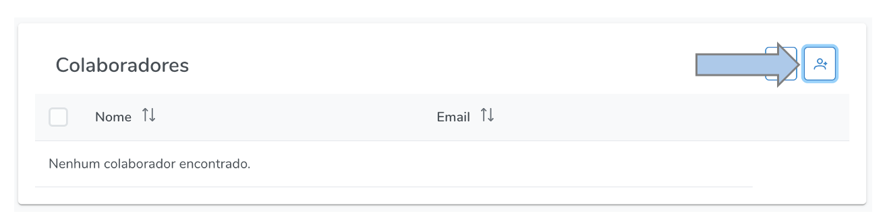
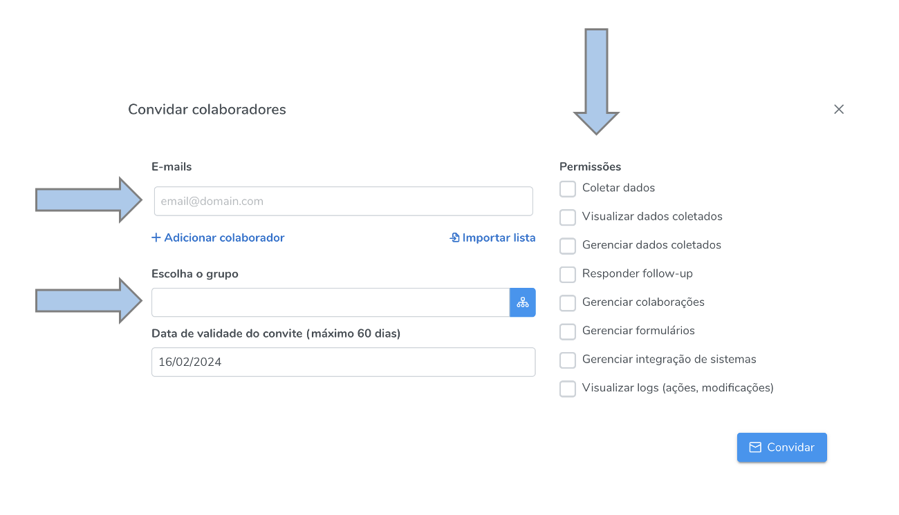
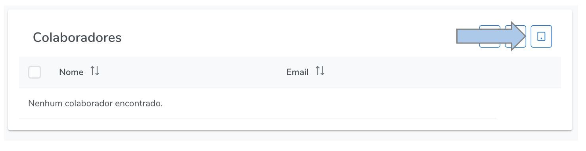
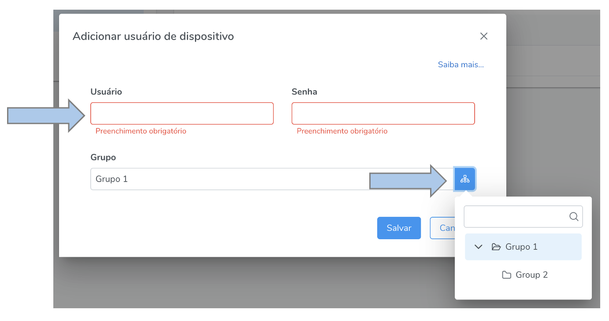

# Colaboradores e Usuários Dispositivo

## Colaborador vs Usuário dispositivo
Nesta nova versão do Hashdata, há uma distinção entre **colaboradores** e **usuários dispositivo**. Os **colaboradores** são **pessoas** que possuem uma conta no Hashdata e que foram convidadas a colaborar na sua conta. Neste caso, você estabelece o nível de acesso que eles terão, que pode ser desde coletor de dados, até gestor da conta, adiante detalhamos cada um dos níveis de acesso. Os usuários dispositivo, por outro lado, não têm conta própria e são criados pelo próprio gestor da conta. 

Os **usuários de dispositivos** são tipos especiais de usuários vinculados a dispositivos móveis, como smartphones e tablets. Eles não possuem acesso à versão web do HashData.
Eles só possuem permissão para realizar coletas em formulários selecionados, na área de trabalho em que foram criados. Este tipo de usuário não pode ser destinatário de notificações e e-mails, bem como não pode ser convidado a colaborar em outras áreas de trabalho.

Exemplos comuns de usuários dispositivos: `tablet1`, `tablet2`, `pesquisador3`, etc.

## Colaboradores {#collaborators}

Para gerenciar os colaboradores, acesse o ícone  no menu principal.

## Adicionar colaboradores

Para adicionar um novo colaborador acesse:

Posteriormente insira o/os e-mail/s dos colaboradores que serão convidados, selecione o grupo que ele/s participarão e estabeleça as permissões a serem concedidas e clique em "convidar".

As permissões são os níveis de acesso que os colaboradores terão em sua conta. A seguir detalhamos cada uma delas. Após aceito o convite, o colaborador aparecerá em sua conta com os níveis de acesso estabelecidos no convite e que podem ser alterados a qualquer momento clicando sobre o nome do colaborador a ser editado.

## Permissões (níveis de acesso) {#permissions}

### Coletar dados
- Coletar dados

### Gerenciar dados coletados:
  - Visualizar dados coletados (listagem de coletas)
  - Visualizar gráficos (dados agregados)
  - Geração de PDF da coleta
  - Visualização e Download das fotos coletadas (arquivo ZIP)
  - Alterar e excluir coletas
  - Excluir todas as coletas de uma vez
  - Compartilhar coleta (PDF) por email diretamente do sistema
  - Visualizar formulários privados (mas para responder é necessário a permissão "COLETAR DADOS")
  - Visualizar o dashboard "Quantidade de respostas (mês atual e mês anterior)"

### Gerenciar colaboradores:
  - Convidar colaborador
  - Visualizar colaborações
  - Editar colaboração
  - Excluir colaboração
  - Visualizar convites de colaboradores
  - Cancelar convite de colaborador (antes de aceito)
  - Criar, alterar e excluir grupos de colaboradores
  - Organizar colaboradores em grupos

### Gerenciar permissões:
  - Autorizar e revogar acesso de colaboradores/grupos a pastas/formulários
  - Visualizar acessos autorizados
  - Alterar permissões de colaboradores

### Gerenciar formulários:
  - Criar, alterar, clonar, compartilhar e excluir formulários
  - Visualizar formulários privados (mas para responder é necessário a permissão "COLETAR DADOS")
  - Criar, alterar, clonar, visualizar e excluir notificações sobre coletas
  - Publicar, despublicar e arquivar formulários
  - Simular respostas para formulários
  - Aceitar formulário compartilhado por outro usuário
  - Criar, alterar e excluir pastas de formulários
  - Organizar formulários em pastas

## Usuários Dispositivo

Para gerenciar os usuários dispositivos, acesse o ícone  no menu principal.

## Adicionar Usuários Dispositivo

Para adicionar um novo usuário dispositivo acesse:

Em seguida, preencha os campos obrigatórios de usuário e senha e selecione o grupo de trabalho (pasta) ao qual esse usuário fará parte.

