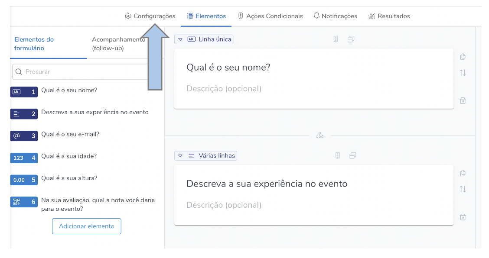
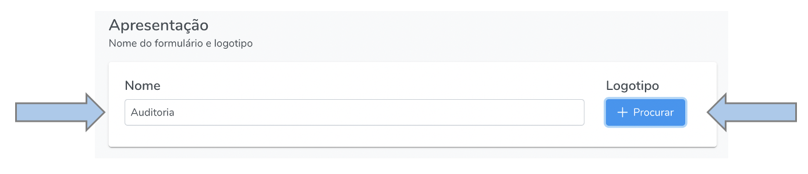
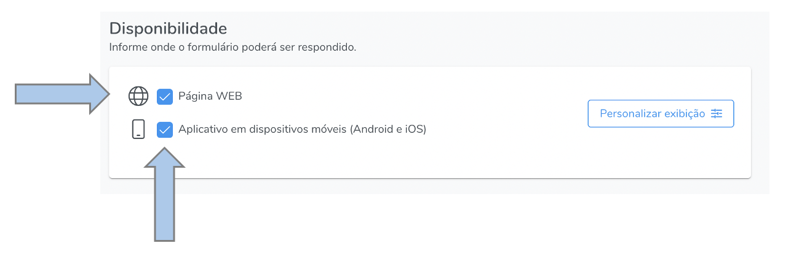
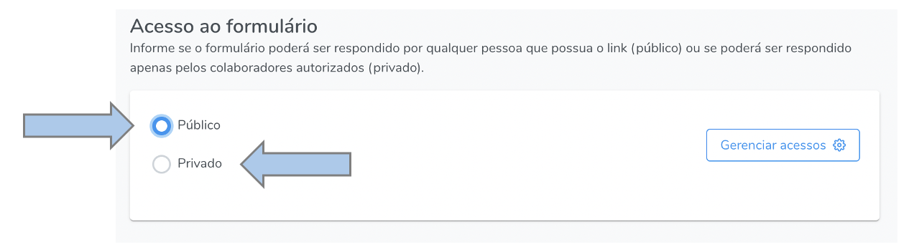
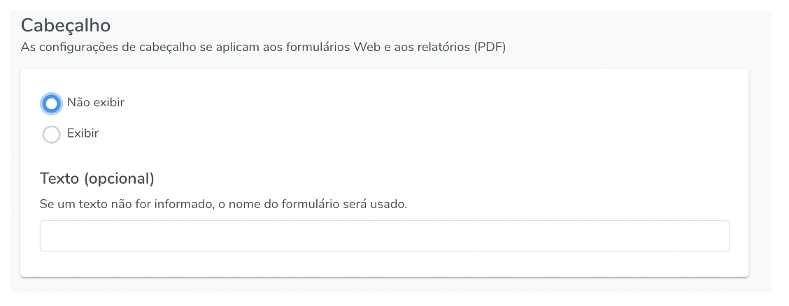
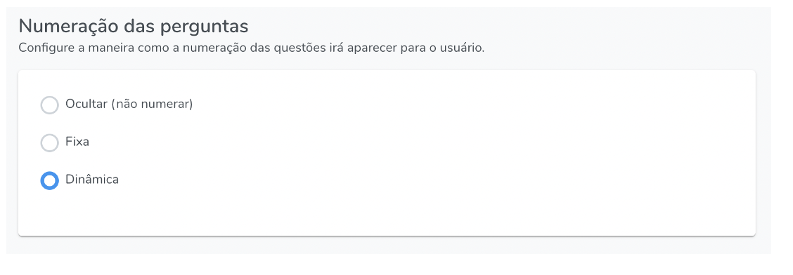
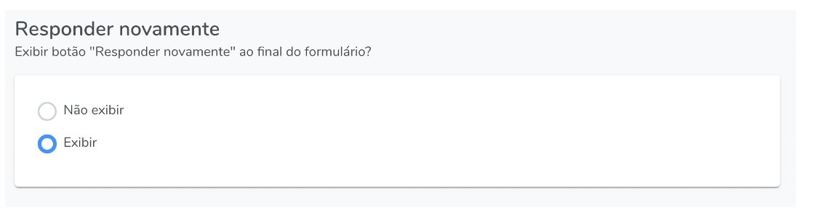

# Configurações do Formulário

Nesta seção é onde são encontradas as configurações gerais do formulário, tais como: nome, disponibilidade (WEB ou APP), acesso ao formulário (público ou privado), definições do cabeçalho, padrão de enumeração, opção de exibir o botão de responder novamente o formulário e pergutnas de acompanhamento (follow-up).

## Como acessar

Para acessar as configurações, abra a tela de edição de formulários e clique em "configurações", conforme a imagem abaixo:

## Apresentação {#presentation}

Nesta seção é onde se configura o nome do formulário e o logotipo a ser utilizado (opcional).

## Disponibilidade

A disponibilidade diz respeito ao acesso ao formulário, isto é, se ele poderá ser acessado via WEB (através de link e QR code) e/ou aplicativo.

## Acesso ao formulário 

Se o acesso for público e o formulário estiver configurado para disponibilidade via WEB, qualquer pessoa de posse do link poderá respondê-lo. Caso o acesso seja privado, somente colaboradores com a permissão de responder formulário serão capazes de respondê-lo.

## Cabeçalho

O cabeçalho é o título a ser exibido no formulário, tanto na versão WEB do formulário, quanto nos relatórios exportados em PDF. 

## Numeração das perguntas

Há três possibilidades de se configurar a enumeração das perguntas do formulário: **1) ocultar**, este caso o sistema não exibirá a enumeração, **2) Fixa**, onde o sistema mantem a enumeração estabelecida pela ordem exitente na tela de edição dos formulários, ou seja, mesmo que haja uma ação condicional ou um conteúdo condicional que oculte alguma questão, os números das questões se manterão; e **3) Dinâmica**, neste caso, quando houver alguma questão oculta, por uma ação condicional ou por um conteúdo condicional, a enumeração manterá a sequência de exibição para o usuário, mantendo a série dos números naturais.

## Responder novamente

Exibe um botão "responder novamente" ao final do formulário na versão WEB.