# Elementos (Entrada de Dados)

Os elementos são os tipos de perguntas disponíveis para a criação dos formulários e estão divididos em dois grandes grupos, **1) Entrada de dados** e **2) Exibição.** 

Os elementos de entrada de dados estão subdivididos em: **texto**, **números**, **seleção única**, **múltipla seleção**, **data e hora**, **avaliação** e **outros**.

Eles são acessados na tela de edição de formulário:

Para informações detalhadas, acesse a seção **formulários**. 

## Elementos do tipo texto

Os elementos do tipo texto são aqueles em que a entrada de dados é uma string (texto). Nesse tipo de entrada de dados são gerados os seguintes relatórios: extrato de coletas e tabela de respostas, as quais podem ser exportadas em PDF e XLS.

Nenhuma das questões do tipo texto dependem de configuração adicional, isto é, basta inserir a pergunta que será exibida para o/s usuário/s. No caso das questões do tipo Campo formatado, é necessário configurar a máscara desejada.

Exemplo:

### Questões de texto disponíveis:

### Linha única  

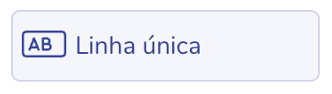

Permite a entrada de texto  sem a inserção de parágrafro. 

Exemplo:

### Várias linhas

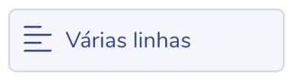

Permite a entrada de texto com inserção de várias linhas e parágrafos.

Exemplo:

### E-mail

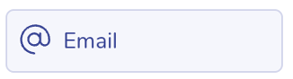

Permite a inserção de e-mail, cujo destinatário poderá uma cópia da coleta realizada, caso seja configurada a notificação para esta finalidade. Para detalhes adicionais, acesse a seção **notificações**.

Exemplo:

### Campo formatado

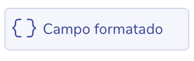

Permite uma entrada de texto personalizada, onde só serão aceitos valores especificados na mascara, a qual deve ser configurada nos atributos de conteúdo, conforme imagem abaixo:

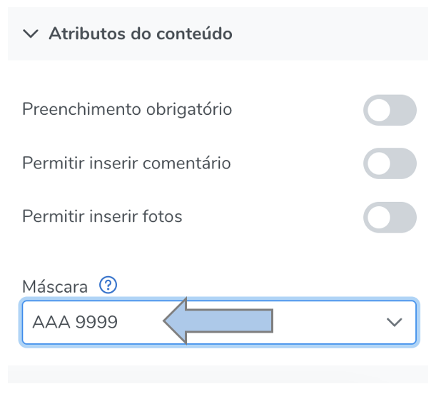

Como no exemplo anterior, para configurar um entrada de placa de veículo, serão aceitos somente  valores no formato AAA 9999, isto é 3 letras maiúsculas, seguidas de 4 números (o espaço entre eles é opcional).

Exemplo:

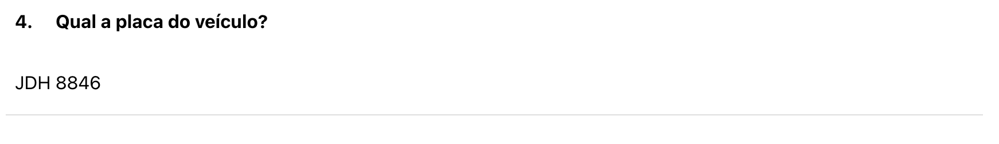

A máscara do campo formatado respeita as seguintes regras de formação:

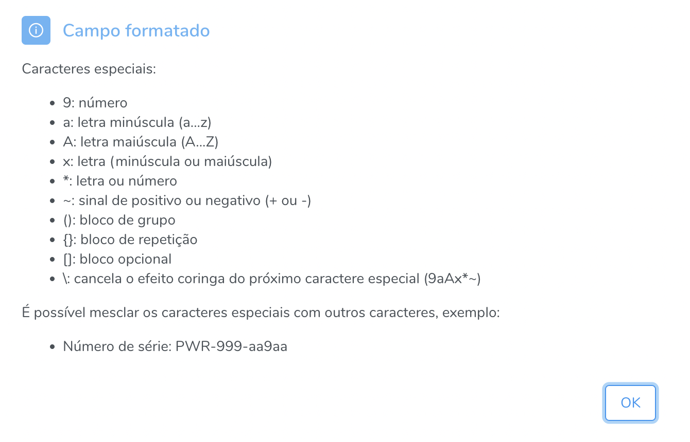

## Elementos do tipo número

Os elementos do tipo número são aqueles em que a entrada de dados é numérico ou pode ser convertido em uma quantidade. Nesse tipo de entrada de dados é possível realizar cálculos automáticos e também são gerados os seguintes relatórios: análises gráficas, extrato de coletas e tabela de respostas, as quais podem ser exportadas em PDF e XLS.

### Questões numéricas disponíveis:

### Inteiro

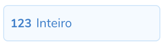

Permite a entrada de números inteiros (sem vírgula). 

Exemplo:

### Decimal

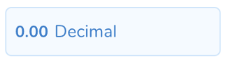

Permite a entrada de número racional (com vírgula).

Exemplo:

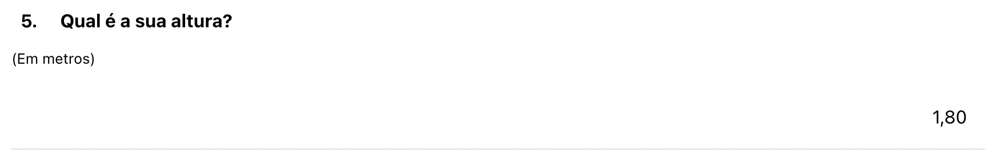

### Emojis

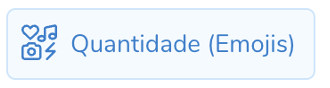

Permite a entrada de emojis, que podem representar a quantidade selecionada.

Exemplo:

## Elementos de seleção única

Os elementos de seleção única são aqueles em que a entrada de dados permite selecionar uma dentre várias opções (questão de múltipla escolha com apenas uma resposta). Nesse tipo de entrada de dados é possível realizar cálculos automáticos e também são gerados os seguintes relatórios: análises gráficas, extrato de coletas e tabela de respostas, as quais podem ser exportadas em PDF e XLS.

### Menu suspenso

### Radio

### Botões

## Elementos de múltipla seleção

Os elementos de múltipla seleção são aqueles em que a entrada de dados permite selecionar uma ou mais opções dentre várias (questão de múltipla escolha com mais de uma resposta). Nesse tipo de entrada de dados é possível realizar cálculos automáticos e também são gerados os seguintes relatórios: análises gráficas, extrato de coletas e tabela de respostas, as quais podem ser exportadas em PDF e XLS.

### Caixa de seleção

### Botões

## Elementos de data e hora

### Data e hora

### Data

### Hora

## Elementos de avaliação

Os elementos de avaliação são aqueles em que a entrada de dados permite selecionar uma dentre várias opções (questão de múltipla escolha com apenas uma resposta), no entanto com recurso gráfico (emojis). Nesse tipo de entrada de dados é possível realizar cálculos automáticos e também são gerados os seguintes relatórios: análises gráficas, extrato de coletas e tabela de respostas, as quais podem ser exportadas em PDF e XLS.

### Expressões faciais

### Emojis

## Elementos especiais

### Enviar arquivos

### GPS

### Campo calculado (fórmula)

### Campo calculado (script)

Para essa funcionalidade acesse: Campo calculado (script)

### Ordenar / priorizar

### Fotos / imagens

### Assinatura