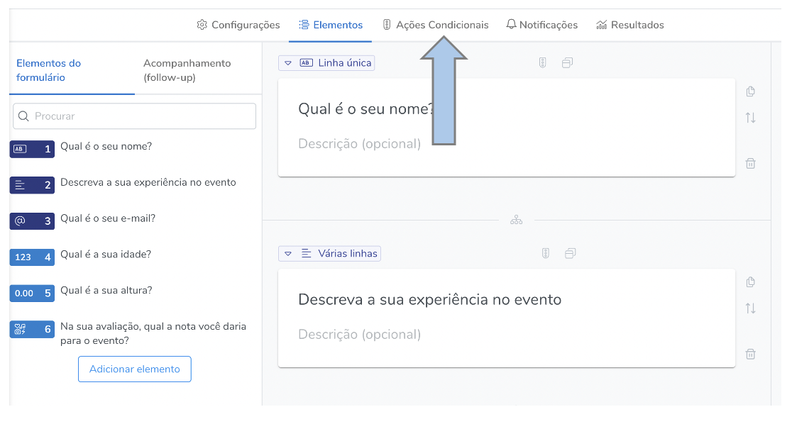
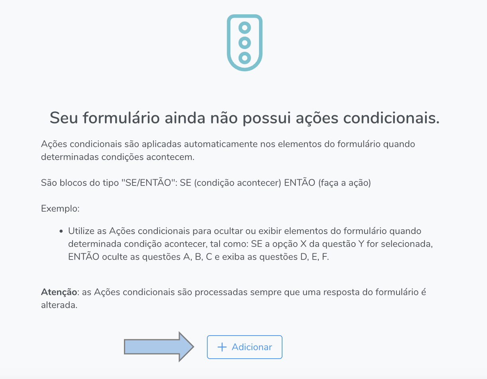
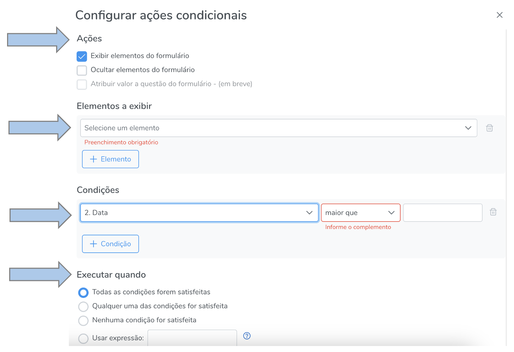

# Ações condicionais

As ações condicionais servem para deixar o seu formulário inteligente e são aplicadas automaticamente nos elementos do formulário quando determinadas condições acontecem. A estrutura lógica dessas ações são do tipo "SE/ENTÃO": SE (condição acontecer) ENTÃO (faça a ação)

Exemplo:

Utilize as Ações condicionais para ocultar ou exibir elementos do formulário quando determinada condição acontecer, tal como: SE a opção X da questão Y for selecionada, ENTÃO oculte as questões A, B, C e exiba as questões D, E, F.

**Atenção: as Ações condicionais são processadas sempre que uma resposta do formulário é alterada. Ou seja, as modificações realizadas em um formulário serão aplicadas a todas as respostas prévias**

## Como acessar

Para acessar as ações condicionais, abra a tela de edição de formulários e clique em "ações condicionais", conforme a imagem abaixo:

Em seguida:

Estabeleça as ações condicinais, isto é, determine quais elementos devem ser exibidos ou ocultados e, posteriormente, defina quais são esses elementos. Estabeleça as condições de satisfação e a regra de execução a ser seguida, conforme a imagem abaixo:

Após a realização dos procedimentos mencionados, salve a ação condicional. Sempre que quiser adicionar ou alterar alguma ação, basta acessar novamente a página de ação condicional, adicionar, ou selecionar uma ação condicinal, a qual deseja-se modificar. 
