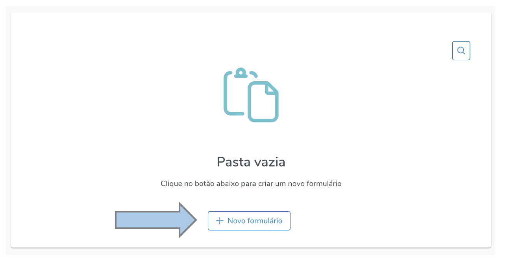
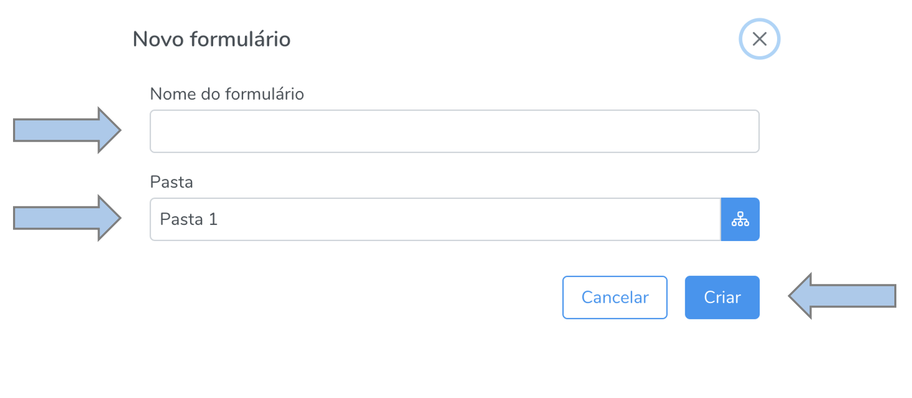
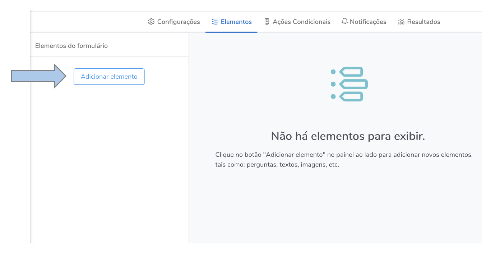
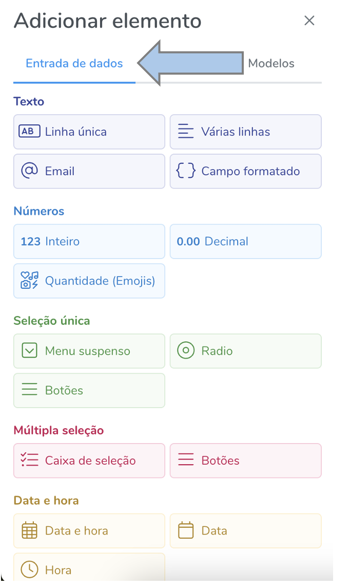
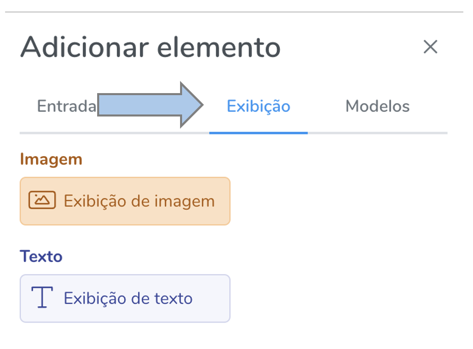
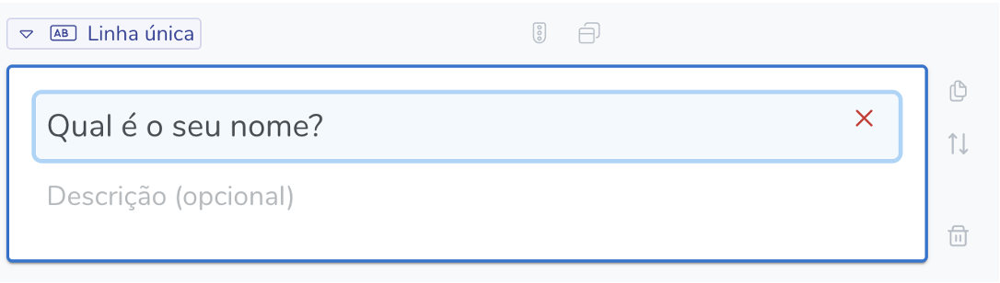
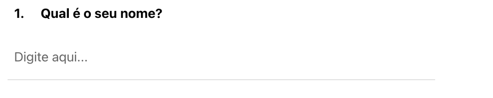
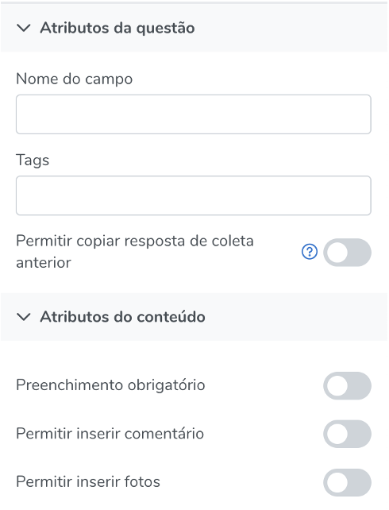
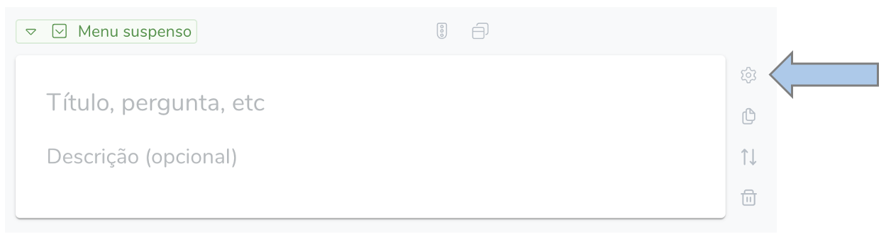
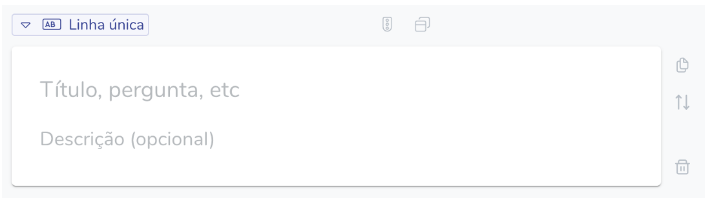

# Formulário

Para criar um novo formulário e/ou gerenciar as funcionalidade de um formulário, acesse o botão  no menu principal.

## Criar novo formulário

Para criar um novo formulário vá em “Novo formulário”.  

Insira o nome do formulário e selecione a pasta de destino e clique em “criar”.

Selecione a opção "Adicionar elemento" 

Selecione a entrada de dados, que é o tipo de questão desejado e estão agrupados por: Texto, Números, Seleção Única, Múltipla seleção, Data e hora, avaliação e outros. 

Há também os elementos de exibição, a partir dos quais é possível exibir imagens e textos em seu formulário.

Uma vez selecionada a pergunta a ser inserida no formulário, será aberta uma tela de edição, em que se deve colocar o título da pergunta. Importante notar que o que for configurado aqui é o que aparecerá para o usuário final que responderá o formulário.

Exemplo na tela de edição:

Exemplo de resultado final para o respondente:

Ao selecionar uma questão inserida, aparecerão automaticamente no canto direito da tela as opções de configuração dos atributos da questão e os atributos de conteúdo. Nesta seção pode-e configurar se o preenchimento da questão é obrigatório, inserir comentários, inserir fotos, permitir copier resposta de coleta anterior. Para a explicação quanto ao nome do campo e tags, confira a seção de campo calculado.

Quando houver a necessidade de configuração adicional, aparecerá o ícone abaixo. Isto ocorre no caso de questões como as de múltiplas opções, por exemplo, em que é necessário configurar quais são as possibilidades de resposta.

Nas questõs de texto, por exemplo, não se exige configurações adicionais, neste caso, basta adicionar a pergunta que será exibida para o usuário no campo “Título, pergunta, etc”. 

