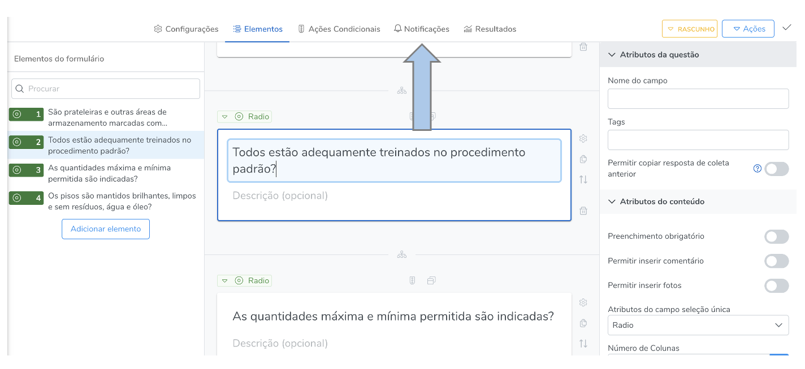
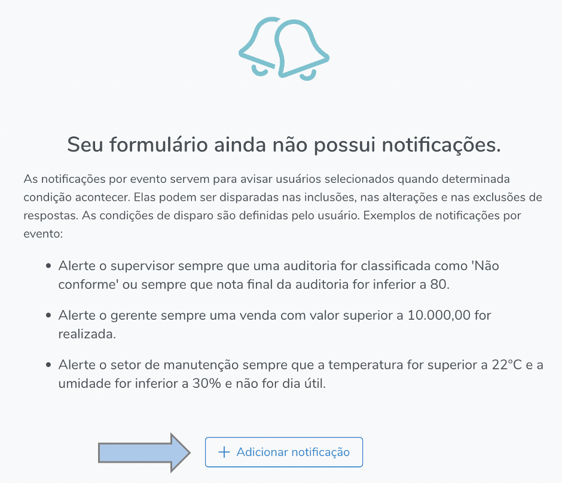
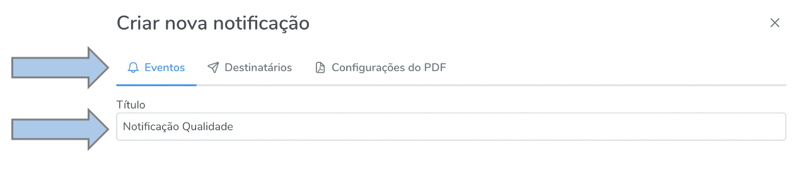
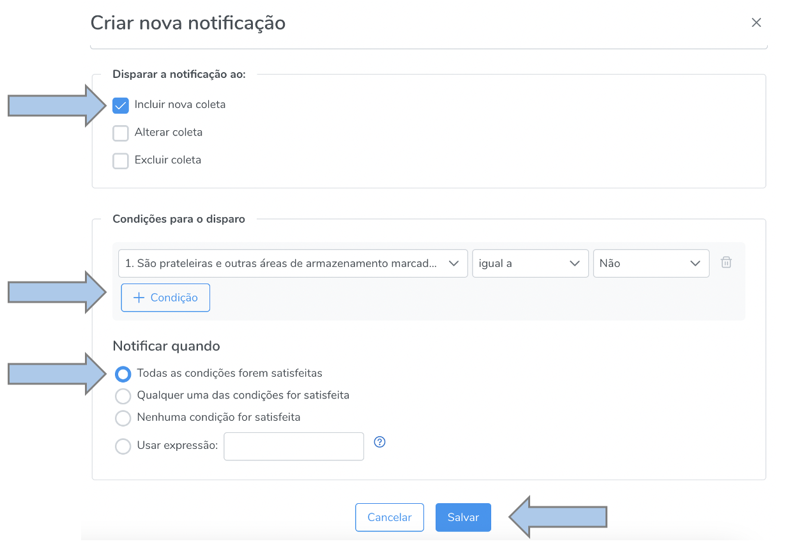
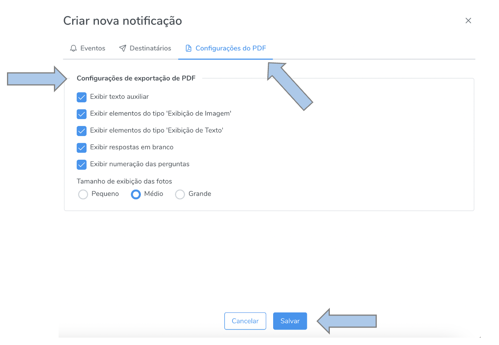

# Notificações

As notificações servem para alertar quanto a algum evento relevante que tenha ocorrido em uma coleta. Por exemplo, se um item de uma auditoria está **não conforme** ou se o resultado geral está **abaixo** do esperado ou ainda se a temperatura de algum equipamento está **superior** à recomendada. Neste caso, configura-se uma notificação para que o Hashdata automaticamente informe os destinatários quanto ao evento de interesse.

Além de notificar o destinatário por e-mail e/ou pelo aplicativo, o sistema encaminha o extrato da coleta em questão.

## Como acessar

Na seção formulário, abra o formulário desejado e vá em "notificações".

Em seguida acesse o botão "adicionar notificação".

Na seção "eventos" adicione o título para a notificação que será criada.

Defina o critério de disparo da notificação, que pode ser **incluir nova coleta**, **alterar coleta** ou **excluir coleta**. Selecione a condição ou condições de disparo e a quantificação lógica do disparo, isto é, quanto **todas** as condiçõees forem satisfeitas, quando **qualquer** uma das condições for satisveita, **nenhuma** condição for satisfeita ou utilize uma expressão personalizada com conectivos lógicos. Feitas essas configurações, salve.

No exemplo abaixo, foi estabelecida uma condição de disparo, qual seja: **toda** vez que a pergunta numero 1 for **igual** a **não**, o sistema enviará uma notificação para o destinatário ou destinatários selecionado/s.

Por fim, configure os requisitos do relatório a ser encaminhado juntamente a notificação.

