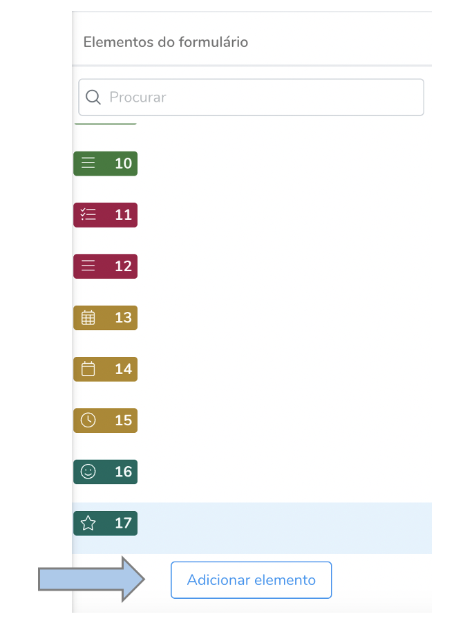
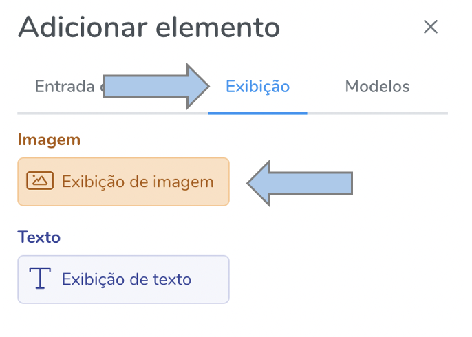
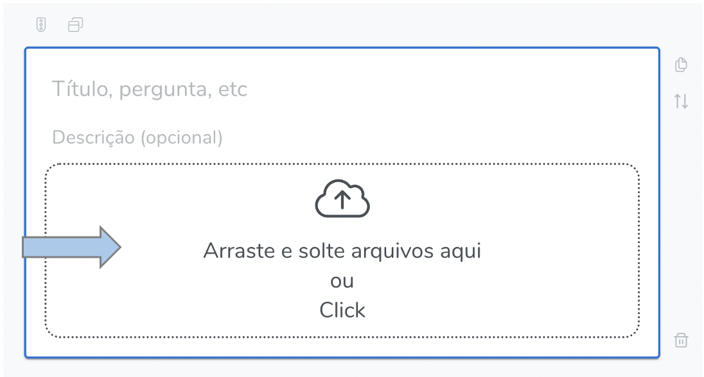
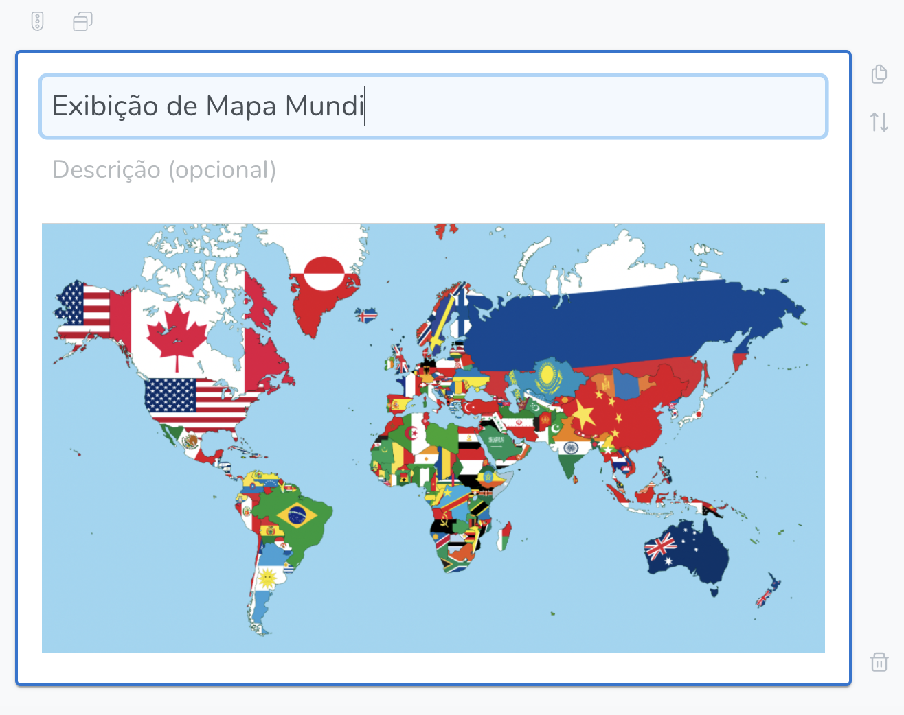
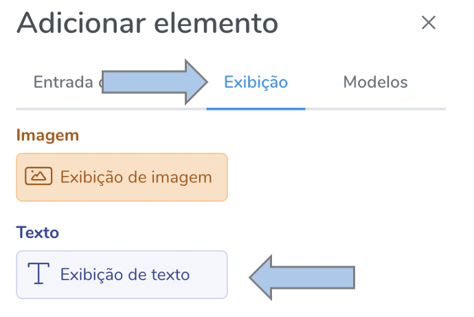
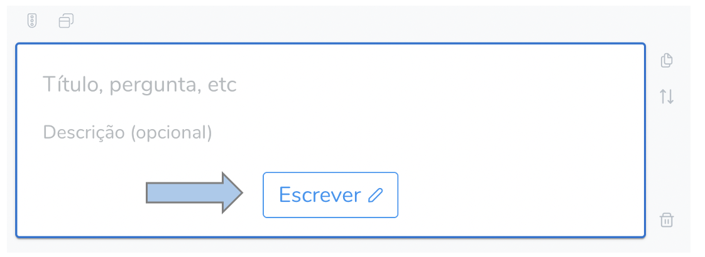
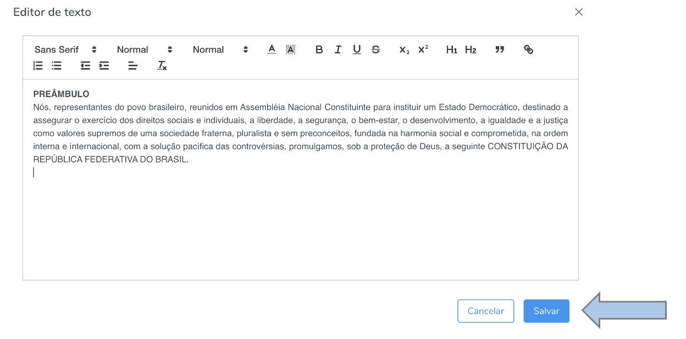

# Elementos (Visualização)

Os elementos são os tipos de perguntas disponíveis para a criação dos formulários e estão divididos em dois grandes grupos, **1) Entrada de dados** e **2) Exibição.** 

Os elementos de exibição estão subdivididos em: **exibição de imagem** e **exibição de texto**.

Eles são acessados na tela de edição de formulário:

Para informações detalhadas, acesse a seção **formulários**. 

## Exibição de imagem

Permite a exibição de imagem para os usuários que acessarão o formulário para respondê-lo. Para isto, acesse o botão "adicionar elementos", na tela de edição de formulários, a seguir vá em "exibição" e depois "exibição de imagem".

Em seguida clique no campo abaixo e selecione o arquivo.

Adicione um título e/ou uma descrição para a imagem, caso seja de interesse:

## Exibição de texto

Permite a exibição de textos para os usuários. Este procedimento é semelhante ao de exibição de imagens, portanto adicione um elemento e selecione a opção "exibição de texto".

Adicione um título e/ou uma descrição para o texto, caso seja de interesse, e selecione então "escrever".

Escreva o texto no editor ou copie e cole de alguma outra fonte e clique em "salvar".

