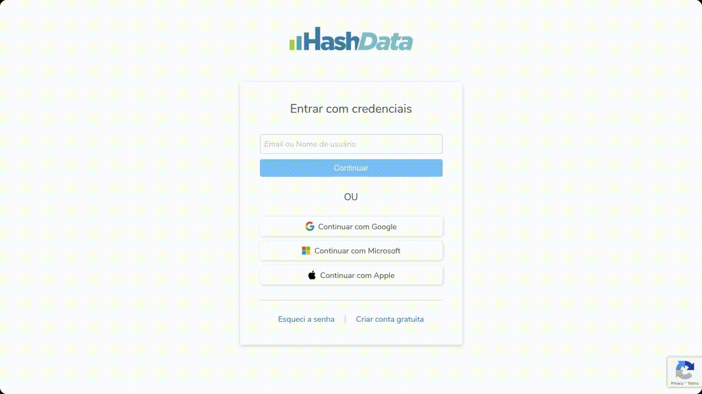
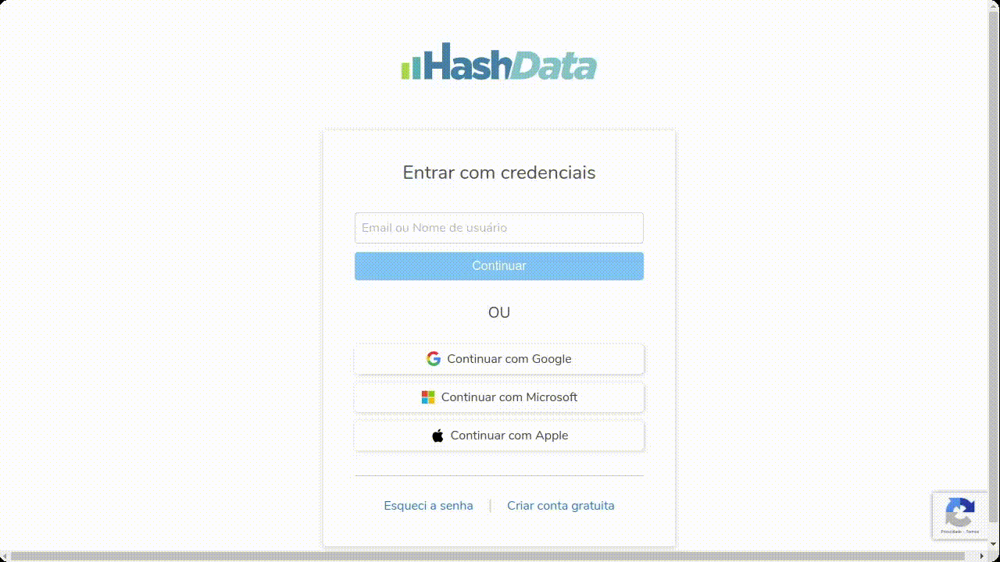

import React from 'react';
import Tabs from '@theme/Tabs';
import TabItem from '@theme/TabItem';
import Mermaid from '@theme/Mermaid';
export const standardCaption = ' Clique na imagem para ampliá-la'
export const createAccountUsingValidEmail = 'Passo a passo para criar uma conta no Hashdata utilizando um e-mail válido.' + standardCaption;
export const createAccountUsingGoogleMicrosoftApple = 'Passo a passo para criar uma conta no Hashdata validando seu acesso por meio de uma ' +
    'conta Google, Microsoft ou Apple.' + standardCaption;

# Introdução {#introduction}

Bem-vindo ao **Hashdata**! Este guia foi elaborado para ajudá-lo a explorar e aproveitar ao máximo as funcionalidades
oferecidas por nossa plataforma de criação e gerenciamento de formulários online. O Hashdata é uma ferramenta poderosa e
intuitiva, projetada para facilitar a coleta e a análise de dados de maneira eficiente e organizada.

## O que é o Hashdata? {#what-is-hashdata}

O Hashdata é uma solução completa para a criação de formulários personalizados, questionários, pesquisas, registros de
eventos e muito mais. Nossa plataforma foi desenvolvida para atender às necessidades de indivíduos e organizações que
buscam uma maneira prática e eficaz de coletar informações. Com o Hashdata, você pode criar formulários com facilidade,
compartilhá-los com seu público-alvo e analisar as respostas de forma integrada.

<Tabs>
    <TabItem value="features" label="Características" default>
        - **Fácil e Rápido**: o Hashdata é muito fácil de se utilizar, não exige pré-requisitos para
        uso da ferramenta. Além disso, o sistema apresenta excelente desempenho e navegabilidade.

        - **Ilimitado**: sem limites de criação de formulários, de coletas/pesquisas, de
        armazenamento e geração de análises.

        - **Acessibilidade e integração**: seus formulários possam ser acessados e preenchidos de
        qualquer dispositivo com conexão à Internet - smartphones, tablets, notebooks ou desktops - e
        integram-se facilmente com outras ferramentas de análise e armazenamento de dados.

        - **Íntegro, restrito e sempre disponível**: todos os seus dados estarão protegidos com as
        tecnologias de criptografia mais avançadas disponíveis no mercado e estarão sempre disponíveis somente
        para você, graças aos recursos de alta disponibilidade e de controle de acesso.

        - **Personalizável**: você escolhe as principais características de seus formulários, desde a
        criação, até as análises resultantes.

        - **Trabalha off-line**: mesmo sem internet é possível preencher formulários via o
        aplicativo, disponível para [Android](https://play.google.com/store/apps/details?id=br.com.hashdata.mobileapp) e
        [IOS](https://itunes.apple.com/br/app/hashdata/id1379827155?ls=1&mt=8).

        - **Inteligente**: possui lógica de navegação sofisticada e de fácil utilização, tornando o
        seu formulário bem mais eficiente.

        - **Colaborativo**: é possível criar e gerenciar as suas equipes de trabalhos com inúmeros
        usuários, estabelecendo o nível de acesso de cada um deles. Ademais, é possível compartilhar gráficos e
        dados com os membros do seu grupo de trabalho ou com membros externos: clientes, parceiros etc.

    </TabItem>

    <TabItem value="key-features" label="Principais Funcionalidades">

        - **Tipos variados de perguntas**: suporte a diversos tipos de perguntas, como múltipla
        escolha, caixas de seleção, listas suspensas, texto, número, escala de avaliação, fotografia, campos
        personalizáveis com o formatos, geolocalização e muito mais!

        - **Lógica de ramificação**: crie formulários dinâmicos que se adaptam às respostas dos
        participantes, proporcionando uma experiência mais relevante e envolvente.

        - **Compartilhamento fácil**: distribua seus formulários via e-mail, link direto ou
        incorporação em websites.

        - **Visualização e exportação de Dados**: gere relatórios no formado XLSX e PDF (*Portable
        Document Format*).

        - **Business Intelligence**: integração automática com nosso poderoso BI. Para mais informações,
        entre em [contato](#user-support) conosco.

        - **Análises instantâneas, individuais e globais**: as análises são realizadas em tempo real
        e, graças aos filtros, é possível estabelecer correlações de análises de um único indivíduo, e seu
        desenvolvimento no decorrer do tempo, ou análises globais considerando a totalidade dos respondentes.

    </TabItem>

    <TabItem value="who-should-use-hashdata" label="Quem deve usar o Hashdata?">

        - **Indústrias de transformação**: para realizar auditorias internas, gerenciar controle de
        qualidade, coletar sugestões dos funcionários sobre processos produtivos e identificar áreas de
        melhoria.

        - **Consultorias**: para realizar diagnósticos empresariais, coletar informações dos
        clientes, gerenciar projetos e avaliações de desempenho.

        - **Partidos políticos**: para conduzir pesquisas de opinião, gerenciar campanhas de doações,
        coletar opiniões de eleitores e realizar inscrições para eventos e reuniões.

        - **Empresas de pesquisas e estatísticas**: para criar e administrar questionários de
        pesquisa, coletar e analisar grandes volumes de dados e gerar relatórios detalhados.

        - **Profissionais de saúde**: para realizar anamneses, coletar informações dos pacientes,
        gerenciar registros de saúde e acompanhar o progresso do tratamento.

        - **Recursos Humanos**: para gerenciar processos de recrutamento, realizar pesquisas de clima
        organizacional, coletar feedback dos funcionários e administrar avaliações de desempenho.

        - **Organizações sem fins lucrativos**: para gerenciar inscrições de voluntários, coletar
        informações dos beneficiários, realizar pesquisas de impacto e gerenciar doações.

        - **Empresas de tecnologia**: para realizar pesquisas de opinião dos usuários sobre produtos
        e serviços, realizar testes de usabilidade e gerenciar processos de desenvolvimento ágil.

        - **Agências governamentais**: para conduzir censos, coletar dados demográficos, administrar
        programas comunitários e medir o nível de satisfação dos cidadãos.

        - **Colégios e professores**: para criar avaliações, questionários, formulários de pesquisa
        de opinião e monitorar o progresso dos alunos.

        - **Empresas e profissionais de marketing**: para conduzir pesquisas de mercado, medir a
        satisfação dos clientes, coletar sugestões sobre produtos e serviços e planejar campanhas de marketing.

        - **Organizadores de eventos**: para gerenciar inscrições, coletar informações dos
        participantes, enviar confirmações automáticas e medir o nível de satisfação pós-evento.

        - **Pesquisadores acadêmicos e científicos**: para realizar estudos, coletar dados de maneira
        organizada, administrar questionários e entrevistas.

    </TabItem>

    <TabItem value="bi-integration" label="Integração com BI">

        **O que é uma aplicação de BI?**

        Uma aplicação de *Business Intelligence* (BI) é uma ferramenta que permite organizar, analisar e apresentar
        dados
        de maneira visualmente acessível para apoiar a tomada de decisões em uma empresa ou organização.

        Com uma aplicação de BI, dados complexos podem ser transformados em informações acessíveis, auxiliando gestores
        a
        identificar tendências, oportunidades e problemas de forma mais rápida e precisa.

        **Vantagens da solução de BI da Hashdata**

        A solução de BI da Hashdata oferece diversas vantagens que se destacam no mercado de análise de dados,
        permitindo
        análises instantâneas, tanto individuais quanto globais. A plataforma é personalizável, possibilitando que as
        visualizações e relatórios sejam adaptados às necessidades específicas de cada negócio.

        Ao utilizar nossa solução de BI, você terá total integração o aplicativo Hashdata, tornando-o um
        hub centralizado para todas as necessidades de dados da sua organização.

    </TabItem>

</Tabs>

## Crie sua conta {#create-your-account}
Antes de acessar a plataforma *web* do Hashdata, é necessário criar uma conta gratuita. Para isso, são disponibilizadas
duas formas de cadastro:
- **Utilizando um e-mail válido**, ou;
- **Validando seu acesso por meio de uma conta Google, Microsoft ou Apple**.

:::tip[Termos de Uso e Política de Privacidade]
Ao criar uma conta no Hashdata, você confirma que leu e aceitou nosso [Termos de Uso](https://hashdata.com.br/pub/licenca/en/licenca.xhtml)
e [Política de Privacidade](https://hashdata.com.br/pub/licenca/en/privacidade.xhtml).
:::

:::info[Área de Trabalho Gratuíta]
Uma **área de trabalho gratuita** é criada automaticamente quando você criar uma conta no Hashdata. Com a **área de trabalho gratuita**,
você pode criar formulários, coletar e analisar dados. Contudo, não lhe é permitido convidar colaboradores essa área de trabalho.
Para mais informações sobre Áreas de Trabalho, acesse [**Áreas de Trabalho, Atores e Responsabilidades**](#desktop-actors-responsibilities).
:::

### Utilizando um E-mail Válido {#use-valid-email}

{createAccountUsingValidEmail}

#### Passo 1: Acessar a página inicial do Hashdata {#step1-goes-to-initial-page}
1. Abra o navegador de sua preferência e acesse a página de login do Hashdata em [my.hashdata.app](https://my.hashdata.app).
2. Na página inicial, procure pela opção **Criar conta gratuíta** e clique no *link* disponível.

#### Passo 2: Informe um E-mail Válido {#step2-enter-a-valid-email}
1. **Use um e-mail a qual você tenha acesso**:
- Insira um endereço de e-mail válido. Este será usado para verificar sua conta e para receber notificações e atualizações;
- Verifique se não há erros de digitação, pois um e-mail incorreto pode impedir a verificação da conta.

2. **Clique no botão Continuar**.

- Ao clicar em **Continuar**, você confirma que leu e aceitou nosso [Termos de Uso](https://hashdata.com.br/pub/licenca/en/licenca.xhtml)
e [Política de Privacidade](https://hashdata.com.br/pub/licenca/en/privacidade.xhtml).

#### Passo 3: Informe seu Nome e Crie uma Senha {#step3-enter-your-name-and-password}
1. **Informe seu nome completo**:
- Preencha o campo com seu nome completo. Esta informação pode ser utilizada para personalizar sua experiência no Hashdata
e para identificar seu perfil em colaborações com outros usuários.

2. **Crie uma senha**:
- Crie uma senha forte para proteger sua conta. Veja a seguir como criar uma senha forte.

:::info[Recomendação para Criar uma Senha Forte]

Criar uma senha forte é essencial para proteger suas informações e contas online. Uma senha forte deve ter no mínimo 8
caracteres e incluir uma combinação de letras maiúsculas, letras minúsculas, números e caracteres especiais. Aqui estão
algumas dicas para criar uma senha segura:

1. **Comprimento Mínimo**: Use no mínimo 8 caracteres. Quanto mais longa a senha, mais difícil será de ser adivinhada ou quebrada.

2. **Combinação de Caracteres**:
- **Letras Minúsculas e Maiúsculas**: Inclua tanto letras minúsculas (a-z) quanto maiúsculas (A-Z). Isso aumenta a complexidade da senha.
- **Números**: Adicione números (0-9) para diversificar ainda mais a sua senha.
- **Caracteres Especiais**: Utilize caracteres especiais, como: `!`, `@`, `#`, `$`, `%`, `^`, `&`, `*`, `(`, `)`, `_`,
`+`, `-`, `=`, para tornar a senha mais robusta.

3. **Evite Informações Pessoais**: Não use informações fáceis de adivinhar, como seu nome, data de nascimento, nome de
familiares ou animais de estimação.

4. **Crie uma Frase ou Sequência Única**: Combine palavras ou frases que façam sentido para você, mas que sejam difíceis
para os outros adivinharem. Por exemplo, "MeuCãoCorre@123!" é mais segura do que "senha123".

5. **Evite Sequências e Padrões Comuns**: Não use sequências de teclado simples como "123456", "qwerty", ou "abcdef",
pois são fáceis de serem descobertas.

6. **Use um Gerenciador de Senhas**: Considere utilizar um gerenciador de senhas para gerar e armazenar senhas complexas
e únicas para cada uma das suas contas. Isso evita a necessidade de memorizar senhas complicadas e reduz o risco de reutilização de senhas.

7. **Atualize Suas Senhas Regularmente**: Mude suas senhas periodicamente para aumentar a segurança, especialmente se
houver suspeita de que sua conta possa estar comprometida.

Seguindo essas recomendações, você pode criar senhas seguras que ajudam a proteger suas informações e reduzir o risco de
acesso não autorizado à sua conta.
:::

3. **Clique no botão Continuar**.

#### Passo 4: Verifique seu E-mail {#stpe4-verify-your-email}
1. **Verificar o e-mail**:
- Após enviar o formulário de registro, você receberá um e-mail de verificação no endereço que você forneceu.
- Abra o e-mail e clique no link de verificação para ativar sua conta.

2. **Não recebeu o e-mail de verificação?**
- Caso não tenha recebido o e-mail de verificação, verifique sua caixa de *spam* ou se seu e-mail foi digitado corretamente;
- Caso o e-mail informado esteja com algum erro, clique em editar e informe seu e-mail novamente;
- Em seguida, clique em **Reenviar e-mail de verificação**.

#### Passo 5: Finalizar o Registro {#step5-complete-registration}
1. **Confirmação do e-mail**:
- Após a verificação do e-mail, será apresentada uma tela de confirmação.

2. **Clique em Continuar**:
- Após o primeiro *login*, o sistema irá apresentar um tutorial de suas principais funcionalidades e você poderá configurar
suas preferências iniciais, como idioma e tema do sistema (claro ou escuro).

#### Dicas Adicionais {#aditional-tips}
1. **Mantenha suas Credenciais Seguras**: nunca compartilhe sua senha com terceiros.
2. **Atualização de Informações**: caso precise atualizar suas informações pessoais, como senha ou e-mail, isso pode ser
feito nas configurações do usuário após o *login*.

### Validando seu Acesso por meio de uma Conta Google, Microsoft ou Apple {#validating-your-access-with-a-google-microsoft-or-apple-account}

{createAccountUsingGoogleMicrosoftApple}

#### Passo 1. Acesse a Página de Login {#step-1-access-the-login-page}
1. Abra o navegador de sua preferência e acesse a página de login do Hashdata em [my.hashdata.app](https://my.hashdata.app).
2. Na página inicial, procure pela opção **Criar conta gratuíta** e clique no *link* disponível.

#### Passo 2. Escolha a Opção de Login Social {#step-2-choose-the-social-login-option}
1. Na tela de login, você verá opções para fazer login usando diferentes métodos.
2. Escolha o serviço que você deseja usar para validar seu acesso. Ao continuar, você confirma que leu e aceitou nosso
[Termos de Uso](https://hashdata.com.br/pub/licenca/en/licenca.xhtml) e [Política de Privacidade](https://hashdata.com.br/pub/licenca/en/privacidade.xhtml):
- **Continuar com Google** para usar sua Conta Google.
- **Continuar com Microsoft** para usar sua Conta Microsoft.
- **Continuar com Apple** para usar sua Conta Apple.

#### Passo 3. Autorize o Acesso {#step-3-authorize-access}
1. Após selecionar a opção de login desejada, você será redirecionado para a página de autenticação do provedor escolhido
(Google, Microsoft ou Apple).
2. Insira seu endereço de e-mail e senha associados à sua conta no provedor escolhido.
3. Pode ser necessário completar a autenticação de dois fatores (2FA), se estiver ativada na sua conta.

#### Passo 4. Permita o Acesso à Conta Hashdata {#step-4-allow-access-to-hashdata-account}
1. Após inserir suas credenciais, você pode ser solicitado a conceder permissão ao Hashdata para acessar certas informações
básicas do seu perfil (como nome e e-mail). Isso é necessário para criar ou vincular sua conta no Hashdata.
2. Clique em **"Permitir"** ou **"Autorizar"** para conceder as permissões necessárias.

#### Passo 5. Acesso Completo {#step-5-complete-access}
1. Uma vez que todas as etapas foram concluídas, você terá acesso à sua conta no Hashdata.
2. Agora você pode começar a usar todas as funcionalidades oferecidas pela plataforma.

#### Dicas de Segurança {#security-tips}
1. **Certifique-se de usar conexões seguras**: Sempre faça login em redes seguras e evite conexões públicas não confiáveis.
2. **Use a autenticação de dois fatores (2FA)**: Se disponível, ative a autenticação de dois fatores para adicionar uma
camada extra de segurança à sua conta Google, Microsoft ou Apple.
3. **Verifique as permissões concedidas**: Revise regularmente as permissões que você concedeu ao Hashdata ou a qualquer outra aplicação.

## Áreas de Trabalho, Atores e Responsabilidades {#desktop-actors-responsibilities}

### Área de Trabalho {#desktop}
No Hashdata, as **áreas de trabalho** funcionam como **espaços colaborativos**, onde os formulários, os dados de coleta e os
colaboradores são organizados. Dentro da uma área de trabalho, determinado grupo de colaboradores é convidado, pelo
proprietário, a interagir nas atividades específicas de coleta de dados segundo o modelo de negócio a qual ela foi proposta.

:::warning Importante entender isso!
Antes de mais nada, para obter melhor aproveitamento do Hashdata, é importante entender alguns conceitos importantes utilizados no sistema.
- **Plataformas**: o Hashdata foi concebido sob duas plataformas: ***web*** e ***mobile***. É na plataforma ***web***, disponível na URL
[https://my.hashdata.app/](https://my.hashdata.app/), que se deve gerir os formulários, colaboradores e dados coletados. A plataforma
***mobile***, disponível para [Android](https://play.google.com/store/apps/details?id=br.com.hashdata.mobileapp) e
[IOS](https://itunes.apple.com/br/app/hashdata/id1379827155?ls=1&mt=8), é responsável exclusivamente para a *coleta de dados*,
ou seja, responder às perguntas dos formulários, anexar fotos, anexar coordenadas geográficas e muitas outras funcionalidades que
somente um dispositivo *mobile* pode oferecer.

- **Área de Trabalho Gratuita**: o Hashdata permite qualquer pessoa criar uma conta no sistema, que lhe dá acesso
tanto na plataforma *web* quanto na *mobile*. Com uma conta, é permitido ao usuário criar uma **área de trabalho gratuita**,
a qual pode ser utilizada para avaliar o sistema. Com a **área de trabalho gratuita**, o usuário pode criar formulários,
coletar e analisar dados. Contudo, não lhe é permitido convidar colaboradores para essa área de trabalho.

- **Área de Trabalho Licenciada**: para que um usuário possa criar uma área de trabalho sem limitações, além da área de trabalho
gratuita, é necessário que ele contrate uma licença de uso do Hashdata. A licença de uso é associada a uma determinada área
de trabalho e a quantidade de colaboradores que podem interagir com ela.

Para mais detalhes sobre o modelo de licenciamento do Hashdata, **[entre em contato conosco](#user-support)**
:::

### Proprietário da Área de Trabalho {#desktop-owner}
- **Proprietário**: o proprietário da área de trabalho é usuário que criou uma conta no Hashdata e, a partir dessa conta,
criou uma área de trabalho. Conforme já explicado, com uma conta no Hashdata é permitido a qualquer pessoar criar uma
**área de trabalho gratuita**, a qual pode ser utilizada para avaliar o sistema. Caso esse usuário necessite de uma área
de trabalho sem limitações, é necessário que ele adquira uma licença, a qual será associada a essa área de trabalho e a
quantidade de colaboradores que podem receber convites para interagir com ela.
- **Responsabilidades**: o proprietário tem o controle total sobre sua área de trabalho, podendo adicionar ou remover
colaboradores (exceto em áreas de trabalho gratuitas), alterar configurações, gerenciar permissões e definir os limites
de visibilidade e acesso. Além disso, o proprietário também controla as configurações gerais, como o plano de assinatura.

### Colaboradores {#desktop-collaborators}
- **Colaboradores**: o proprietário pode adicionar colaboradores à sua área de trabalho até o limite que sua licença de
uso permitir. Para se tornar um colaborador de determinada área de trabalho, é necessário criar uma conta no Hashdata
([clique aqui](#desktop-actors-responsibilities) para mais detalhes). Os colaboradores de uma ára de trabalho, a depender
das permissões concedidas pelo proprietário, podem gerenciar formulários, coletar dados, gerenciar dados coletados e
gerenciar outros colaboradores.
- **Responsabilidades**: A depender do nível de permissão concedida a um colaborador, ele pode assumir todas as tarefas do
proprietário da área de trabalho, exceto alterar o nome da ára de trabalho, modificar a licença de uso e retirar o proprietário
como membro de sua própria área de trabalho.

:::danger Atenção!
Com uma conta no Hashdata uma pessoa pode colaborar (ser um colaborador) em outras áreas de trabalho e, ao mesmo tempo, ser
proprietária das áreas de trabalho que criou na sua conta.

**Quando um proprietário exclui uma determinada área de trabalho de sua propriedade, a qual tem colaboradores associados,
ou simplesmente retira o convite desses colaboradores, a conta desses colaboradores não é excluída do Hashdata.
Elas permanece nas mesmas condições, até porque esses colaboradores pode também ser proprietários de áreas de trabalho.**
:::

### Contas de Dispositivo {#device-accounts}
- **Contas de Dispositivo**: as contas de dispositivo são tipos especiais de contas, ou seja, não estão vinculadas a uma
pessoa específica. Essas contas acessam somente a versão *mobile* do Hashdata, disponível para [Android](https://play.google.com/store/apps/details?id=br.com.hashdata.mobileapp) e
[IOS](https://itunes.apple.com/br/app/hashdata/id1379827155?ls=1&mt=8), e não possuem acesso à versão *web* do sistema.
- **Responsabilidades**: A conta de dispositivo é utilizada tão somente para realizar a coleta de dados, sem a necessidade de
associar a pessoa responsável pela coleta. Ao acessar a versão *mobile* do Hashdata com uma conta de dispositivo, determinada
pessoa tem permissão para realizar coletas de dados em formulários selecionados, contidos na área de trabalho em que foram criados.
Além disso, essa conta não pode ser destinatária de notificações e e-mails.

:::danger Lembre-se!
**Contas de dispositivos são associadas à uma determinada área de trabalho. Caso o proprietário dessa área
de trabalho a exclua, TODAS as contas de de dispositivos associadas serão excluídas.**
:::

## Cinco Passos Fundamentais do Hashdata {#five-fundamental-steps-of-hashdata}

<Mermaid
    value={`
%%{init: {"flowchart": {"htmlLabels": false}} }%%
flowchart LR
    step1([Crie o Formulário]) --> step2([Cadastre as Contas de Dispositivo])
    step2([Cadastre as Contas de Dispositivo]) --> step3([Publique o formulário])
    step3([Publique o formulário])--> step4([Colete os dados])
    step4([Colete os dados])-->step5([Realize as análises])
    `}
/>

### 1. Crie o formulário {#create-the-form}
Para a criação dos formulários, solução da Hashdata oferece campos do tipo: texto, número, escala de avaliação, fotografia,
formatos personalizáveis, geolocalização, dentre outros.

### 2. Crie as Contas de Dispositivo {#create-the-device-accounts}
Os usuários de dispositivos são tipos especiais de usuários vinculados a dispositivos móveis, como *smartphones* e *tablets*.
São os usuários irão realizar as coletas de dados nos formulários selecionados.

### 3. Publique o formulário {#publish-the-form}
Somente após a publicação do formulário, os usuários autorizados poderão iniciar a coleta dos dados. Nas configurações gerais
da publicação, há opções de personalização, como: apresentação (com inclusão da logomarca da empresa) e tipo de acesso.

### 4. Colete os dados {#collect-the-data}
Há duas opções de coleta de dados no Hashdata: via aplicativo web e ou via aplicativo *mobile* (disponível para as plataformas
[Android](https://play.google.com/store/apps/details?id=br.com.hashdata.mobileapp) e
[IOS](https://itunes.apple.com/br/app/hashdata/id1379827155?ls=1&mt=8)) Ambas versões (web ou *mobile*) podem trabalhar *on-line*, neste caso os formulários são enviados automaticamente
para os servidores, ou *off-line*, cuja sincronização ocorrerá somente quando houver disponibilidade de conexão.

### 5. Realize as análises {#perform-the-analyses}
É possível realizar a análise gráfica das respostas, agrupadas pelos valores das respostas ou por data; escolher o tipo
de gráfico, barra, pizza ou linha; baixar arquivo compatível com o padrão MS-Word com todas as questões e gráficos, e;
copiar o gráfico para a área de transferência ou salvar num arquivo.

## Canais de Atendimento e Suporte{#user-support}

Esperamos que este guia lhe forneça todas as informações necessárias para começar a usar o **Hashdata** de maneira
eficiente. Vamos explorar juntos as incríveis possibilidades que nossa plataforma oferece e transformar a maneira como
você coleta e analisa dados!

:::tip[Entre em contato conosco]
Caso surja alguma dúvida adicional, entre em contato conosco pelos nossos canais atendimento, em português e em
inglês, por _Whatsapp_ ou e-mail:

- [**_Whatsapp_ +1 (970) 581-9678**](https://wa.me/19705819678)
- [**contato@hashdata.com.br**](mailto:contato@hashdata.com.br)
:::
