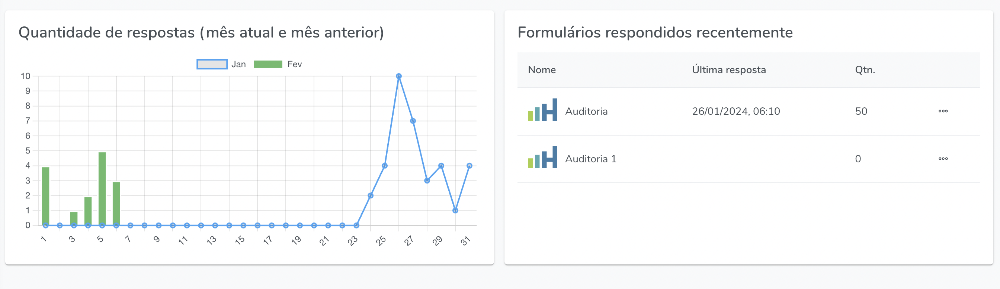
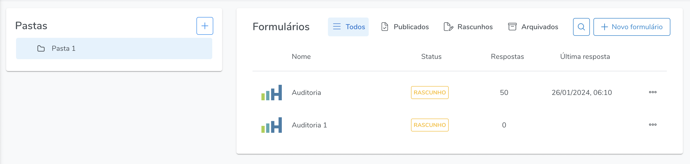
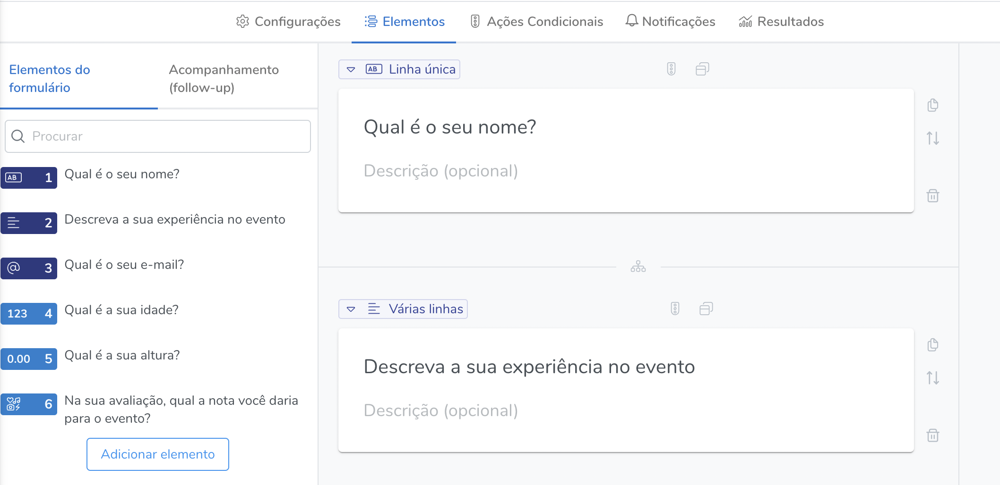
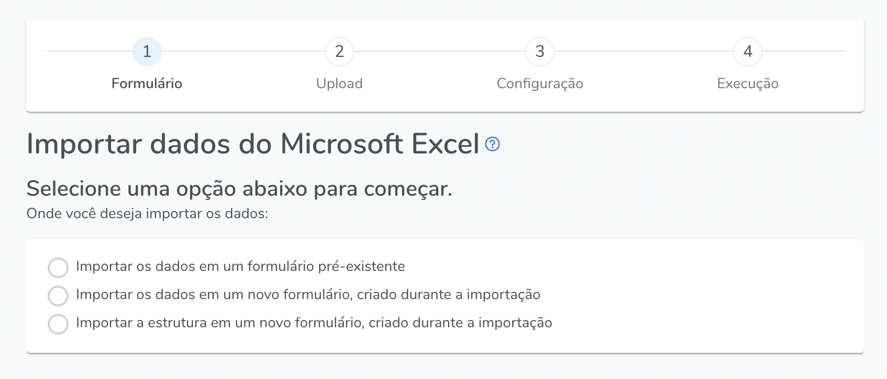
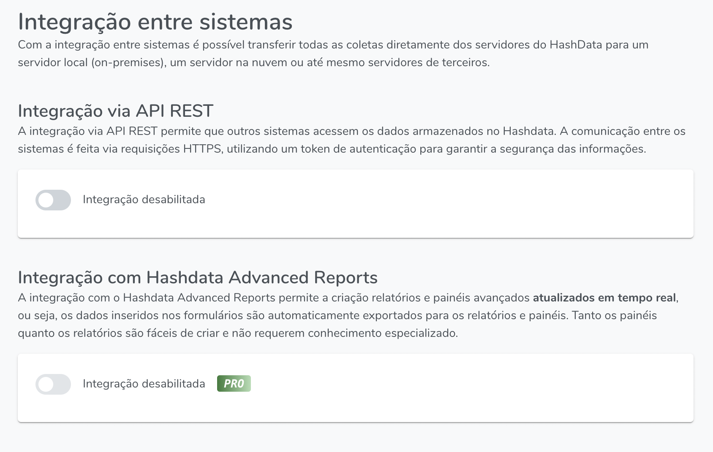

# Menu Principal (Visão geral)

No menu principal você terá acesso às principais funcionalidades do Hashdata. A seguir são apresentados cada um dos ícones lá presentes. 

## Home

    

É a página inicial do sistema, nela estarão disponíveis as últimas coletas realizadas e os últimos formulários respondidos. 

Exemplo:

   

## Formulários

 

Esta é a página mais importante do sistema, pois é nela que é possível criar e editar os formulários. Além disso, é onde estão disponíveis todas as funcionalidades associadas aos formulários, tais como publicação, geração de relatórios, criação de notificações, simulações, análises de resultados, etc.

Exemplos:

  

 

## Colaboradores

   

Nesta seção é possível criar a gerenciar os colaboradores, que são os usuários que contribuirão com sua conta, a depender do nível de acesso, que pode ser desde coletor de dados, até gerenciador de conteúdo. 

## Convites enviados

 Nesta página ficarão registrados todos os convites (aceitos ou não) enviados para os colaboradores.

 ## Compartilhados comigo

No Hashdata é possível compartilhar formulários com qualquer um dos usuários do Sistema, nesta tela ficarão disponíveis todos os formulários que outros usuários compartilharam com a sua conta.

## Respostas pendentes

 

É possível iniciar a resposta de um formulário e salvá-la para finalizar depois, tanto no APP quanto através de Link Web ou QR Code. As respostas salvas para serem finalizadas posteriormente (Web ou QR Code) estarão disponíveis aqui nesta página.

## Importação

 

Aqui há disponível um Sistema complementar do Hashdata que é a ferramenta de importer dados de planilhas XLS, nela é possível popular um formulário já existente ou criar um formulário novo no momento da importação dos dados.

Exemplo:

   

## Integrações

 

Disponibilizamos uma API para que seja possível automatizar a integração com outros softwares.

Exemplo

   

