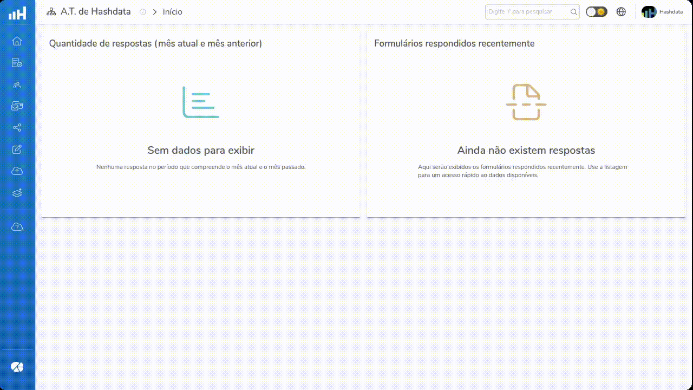

import React from 'react';
import {Link} from 'react-router-dom';
export const standardCaption = '. Clique na imagem para ampliá-la'
export const initialScreamCaption = 'Apresentação da Tela Inicial do Hashdata' + standardCaption;
export const headerCaption = 'Cabeçalho do Hashdata' + standardCaption;
export const headerOptionsCaption = 'Opções disponíveis no cabeçalho do Hashdata' + standardCaption;
import useBaseUrl from '@docusaurus/useBaseUrl';

# Tela Inicial

A tela inicial do Hashdata foi projetada para maximizar a eficiência e a facilidade do uso do sistema. Nela estão disponíveis
as funcionalidades essenciais para gerenciar as tarefas de coleta e análise de dados. O cabeçalho da página e o barra lateral
esquerda, onde fica o **Menu Principal**, sempre serão exibidas. A maior parte da tela será ocupada pelo conteúdo da **Área de
Trabalho**.

{initialScreamCaption}

## Cabeçalho {#header}

{headerCaption}

Dá esquerda para a direita, estão disponíveis as seguintes seções no cabeçalho do aplicativo Hashdata.
- Logomarca Hashdata;
- Mudar Área de Trabalho;
- Pesquisa Global;
- Seleção de Tema;
- Seleção de Idioma;
- Usuário;

{headerOptionsCaption}

### Logomarca Hashdata {#logo}
Clicando na logomarca Hashdata, a aplicação retornará para a **Página Inicial**.

### Mudar Área de Trabalho {#change-desktop}
A opção **Mudar Área de Trabalho** permite que você escolha entre as áreas de trabalho disponíveis em sua conta.
A funcionalidade possibilita mudar da área de trabalho de acordo com uma área específica de negócio.

:::tip[Dica]
Utilize o campo de pesquisa 🔍 para localizar a área de trabalho desejada.
:::

Na opção **Mudar Área de Trabalho** é possível também:
- **Editar o nome da área de trabalho**;
- **Acessar as informações do proprietário**.

### Pesquisa Global {#global-search}
No campo **Pesquisa Global** é possível informar um termo de pesquisa para buscar formulários, pastas, colaboradores,
grupos ou menus.

### Seleção de Tema {#theme-toggle}
O Hashdata disponibiliza a opção de **Seleção de Tema** entre modo claro e escuro, permitindo ajuste a interface de acordo
com a preferência ou condições de iluminação. Essa personalização melhora a experiência do usuário, tornando a visualização
mais confortável em diferentes ambientes.

### Seleção de Idioma {#languages}
A opção de **Idioma** permite a configuração do Hashdata entre diferentes idiomas, garantindo que a plataforma seja acessível
e fácil de usar para falantes de várias línguas. Isso é essencial para equipes multinacionais e para a personalização da
experiência do usuário.

### Usuário {#user-profile}
Ao clicar na foto do perfil do **Usuário**, serão mostradas opções de:
- **Perfil**: alteração das informações pessoais, como nome, e-mail e foto de perfil;
- **Conta e Credenciais**: gerenciamento das configurações de segurança, como alterar a forma de autenticação e
alteração da senha de acesso;
- **Meu plano**:  detalhes do plano atual, incluindo opções de *upgrade*;
- **Sair**: finaliza a sessão do sistema Hashdata de forma segura.

## Menu Principal {#main-menu}
O **Menu Principal**, localizado à esquerda da tela, é a espinha dorsal da navegação no Hashdata. Ele fornece acesso
às funcionalidades principais da plataforma:

- Criar e gerir formulários;
- Criar e gerir colaboradores e usuários;
- Emitir convites para que colaboradores possam atuar em determinada área de trabalho;
- Filtrar e analisar respostas pendentes de formulários;
- Importar dados externos para o Hashdata;
- Realizar integrações com outros sistemas;
- Acessar este Guia de Usuário, e;
- Utilizar o Hashdata Advanced Reports (para mais informações,  [entre em contato conosco](../intro.mdx#user-support)).

## Área de Trabalho
A maior parte da tela inicial é ocupada pela **Área de Trabalho**. Nela, são apresentados um gráfico com a quantidade de
de respostas (no mês corrente e no mês anterior) de formulários publicados e uma lista com todos os formulários respondidos
recentemente.

export const mainMenuData = [
    {imgSrc: "img/main-menu/start.webp", label: "Início", link: "/home"},
    {imgSrc: "img/main-menu/forms.webp", label: "Formulários", link: "/documents"},
    {imgSrc: "img/main-menu/collaborators.webp", label: "Colaboradores", link: "/analytics"},
    {imgSrc: "img/main-menu/invitations.webp", label: "Convites", link: "/settings"},
    {imgSrc: "img/main-menu/shared-with-me.webp", label: "Compartilhados comigo", link: "/search"},
    {imgSrc: "img/main-menu/pending-answers.webp", label: "Respostas pendentes", link: "/messages"},
    {imgSrc: "img/main-menu/importing-data.webp", label: "Importar dados", link: "/files"},
    {imgSrc: "img/main-menu/integrations.webp", label: "Integrações", link: "/history"},
    {imgSrc: "img/main-menu/user-guide.webp", label: "Guia do usuário", link: "/users"},
    {imgSrc: "img/main-menu/advanced-reports.webp", label: "Hashdata Advanced Reports", link: "/calendar"},
];

<table>
    <tbody>
    {mainMenuData.map((item, index) => (
        <tr key={index}>
            <td>
                <Link to={item.link}>
                    <button style={{display: 'flex', alignItems: 'center'}}>
                        
                    </button>
                </Link>
            </td>
            {index % 2 === 1 && <tr/>}
        </tr>
    ))}
    </tbody>
</table>
