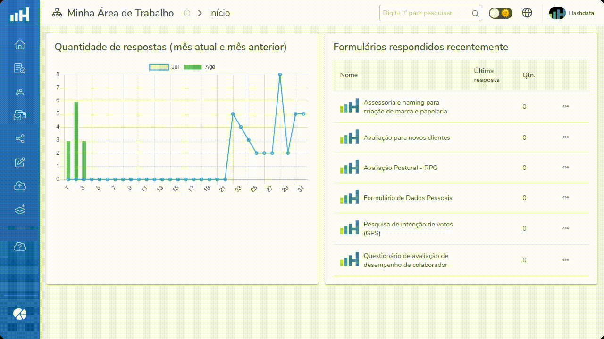
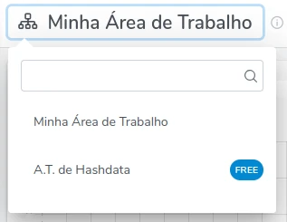
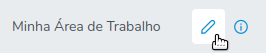

# Tela Inicial

A tela inicial do Hasdata foi projetada para maximizar a eficiência e a facilidade do uso do sistema. Nela estão disponíveis
as funcionalidades essenciais para gerenciar as tarefas de coleta e análise de dados. O cabeçalho da página e o barra lateral
esquerda, onde fica o **Menu Principal**, sempre serão exibidas. A maior parte da tela será ocupada pelo conteúdo da **Área de
Trabalho**.

> A figura a seguir mostra todas as funcionalidades presentes na **Tela Inicial**, clique nela para maximizá-la.

## Cabeçalho {#header}

Dá esquerda para a direita, estão disponíveis as seguintes seções no cabeçalho do aplicativo Hashdata.

### Logomarca Hashdata {#logo}
Clicando na logomarca Hashdata, a aplicação retornará para a **Página Inicial**.

### Mudar Área de Trabalho {#change-desktop}
A opção **Mudar Área de Trabalho** permite a inclusão e a definição de novas áreas de trabalho. A funcionalidade possibilita ao
usuário definir uma determinada área de trabalho de acordo com uma área específica de negócio.

> Clique em pesquisar para localizar a ***Área de Trabalho desejada***.

É possível alterar o nome da área de trabalho, para isso, clique em

### Menu Principal
O **Menu Principal**, localizado à esquerda da tela, é a espinha dorsal da navegação no Hashdata. Ele fornece acesso
às funcionalidades principais da plataforma:

- Criar e gerir formulários;
- Criar e gerir colaboradores e usuários;
- Emitir convites para que colaboradores possam atuar em determinada área de trabalho;
- Filtrar e analisar respostas pendentes de formulários;
- Importar dados externos para o Hashdata;
- Realizar integrações com outros sistemas;
- Acessar este Guia de Usuário, e;
- Utilizar o Hashdata Advanced Reports (para mais informações,  [entre em contato conosco](../intro.mdx#user-support)).

### Área de Trabalho
A maior parte da tela inicial é ocupada pela **Área de Trabalho**. Nela, são apresentados um gráfico com a quantidade de
de respostas (no mês corrente e no mês anterior) de formulários publicados e uma lista com todos os formulários respondidos
recentemente.

### Pesquisa
No campo **Pesquisa** é possível informar um termo de pesquisa para buscar formulários, pastas, colaboradores, grupos ou menus.

### Tema
O Hashdata disponibiliza a opção de **Seleção de Tema** entre modo claro e escuro, permitindo ajuste a interface de acordo
com a preferência ou condições de iluminação. Essa personalização melhora a experiência do usuário, tornando a visualização
mais confortável em diferentes ambientes.

### Idiomas
A opção de **Idiomas** permite a configuração do Hashdata entre diferentes idiomas, garantindo que a plataforma seja acessível
e fácil de usar para falantes de várias línguas. Isso é essencial para equipes multinacionais e para a personalização da
experiência do usuário.

### Usuário
Ao clicar na foto do perfil do **Usuário**, serão mostradas opções de:
- **Perfil**: alteração das informações pessoais, como nome, e-mail e foto de perfil;
- **Conta e Credenciais**: gerenciamento das configurações de segurança, como alterar a forma de autenticação;
- **Plano**:  detalhes do  plano atual, incluindo opções de *upgrade*.
- **Sair**: finaliza a sessão do sistema Hashdata de forma segura.

