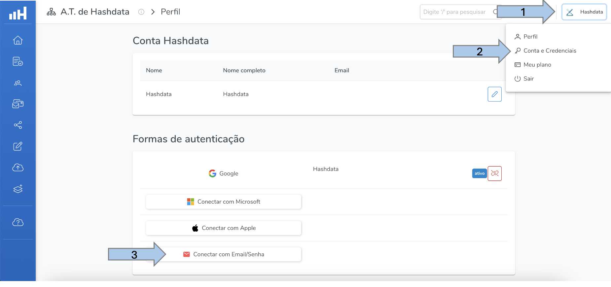

# Migração de Conta

A migração de conta é o procedimento específico para as contas que já utilizavam a versão anterior do Hashdata. Este procedimento é realizado automaticamente pela equipe do Hashdata, no entanto, **caso seja necessário receber e-mails de notificações**, é preciso vincular a nova conta migrada a um e-mail e confirmar conforme as três etapas da imagem abaixo:

  

