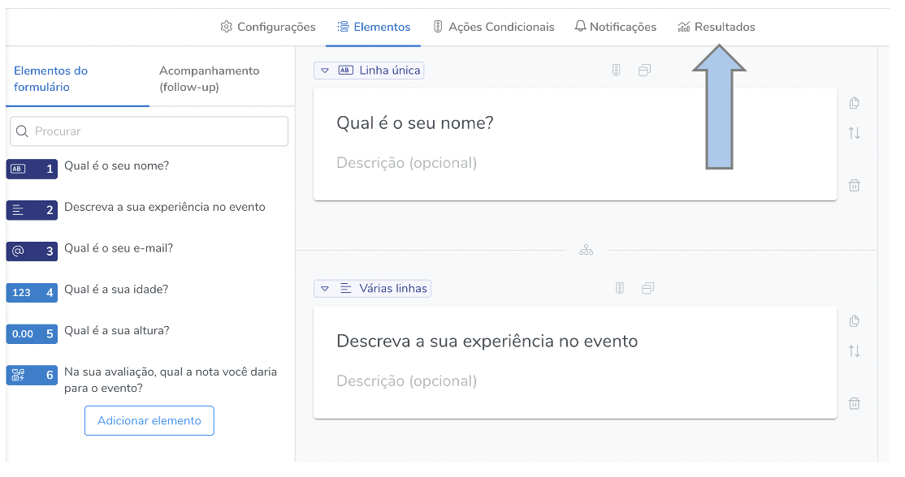
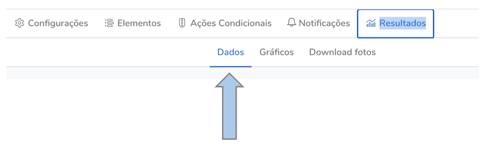
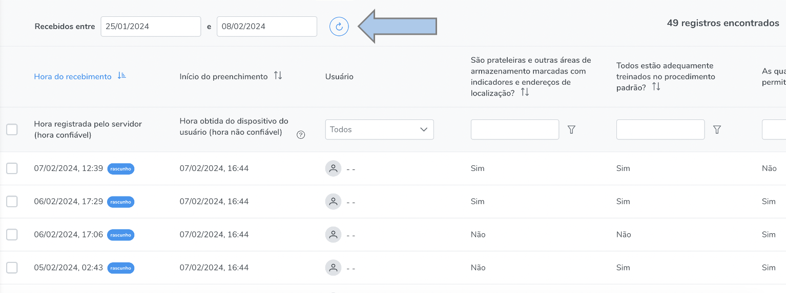
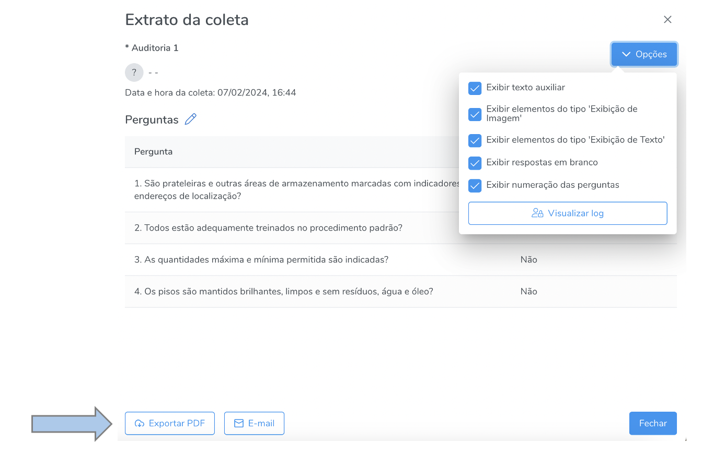
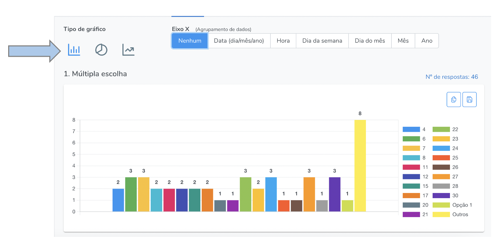
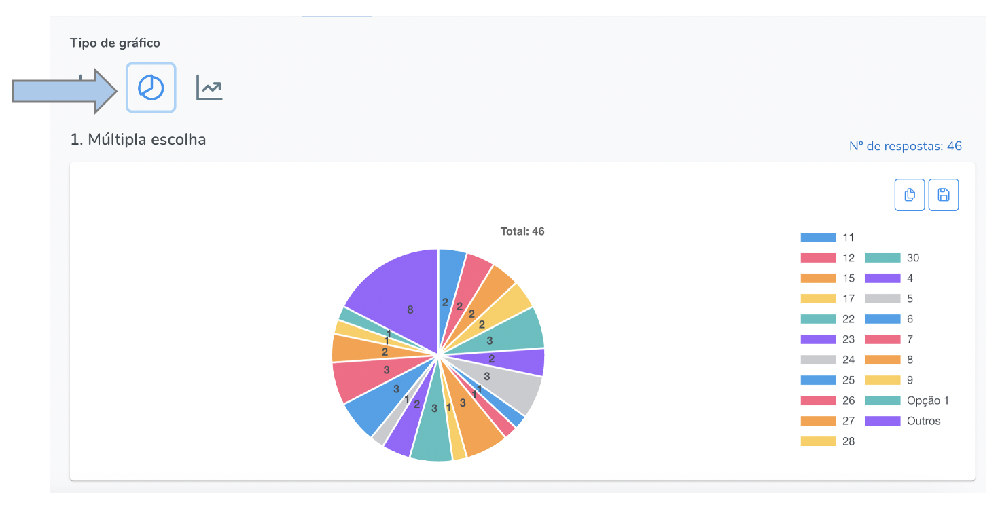
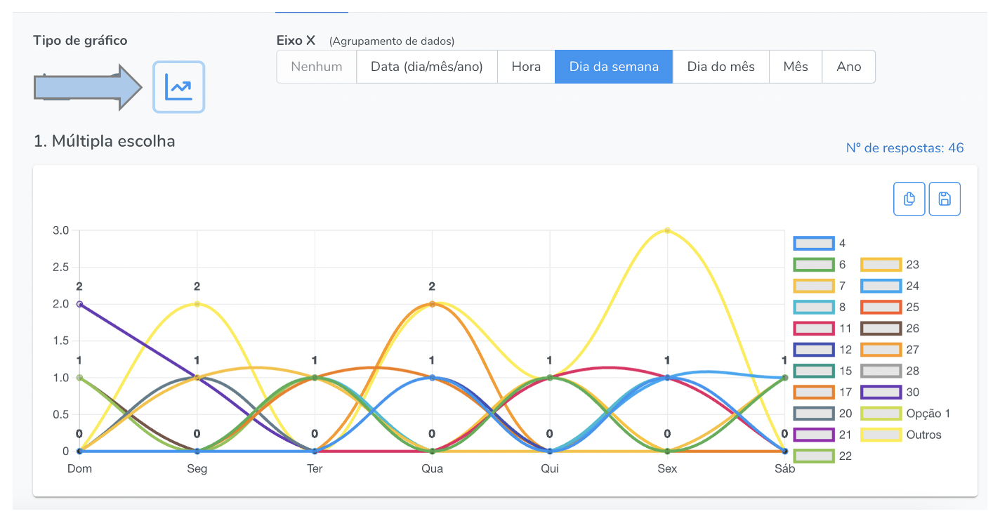
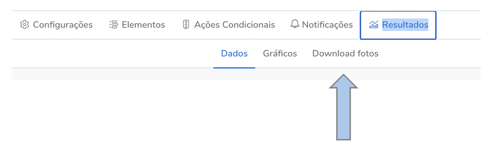

# Resultados

Nesta seção são geradas as análises automáticas pelo sistema, que podem ser planilhas consolidadas com todos os resultados em XLS, extratos individuais das coletas, os quais podem ser exportados em PDF e gráficos (pizza, barras e linhas) que podem ser exportados em DOCX.

## Como acessar

Na seção formulário, abra o formulário desejado e vá em "resultados".

### Dados

As tabelas de respostas são geradas automaticamente, basta acessar a a seção "resultados" e então "dados".

Nesta seção serão exibidas todas as coletas por ordem cronológica. É possível filtrar as coletas por datas específicas, por resposta e exportar os resultados em XLS.

Também é possível acessar cada uma das coletas individualmente e exportar em PDF.

### Gráficos

Os gráficos são gerados automaticamente, basta acessar a a seção "resultados" e então "gráficos".

Há três tipos de gráficos na versão básica do Hashdata: barras, pizza e linhas. Para mais possibilidades analíticas, consulte-nos quanto ao **Hashdata Business Intelligence**.

### Barras

### Pizza

### Linha

