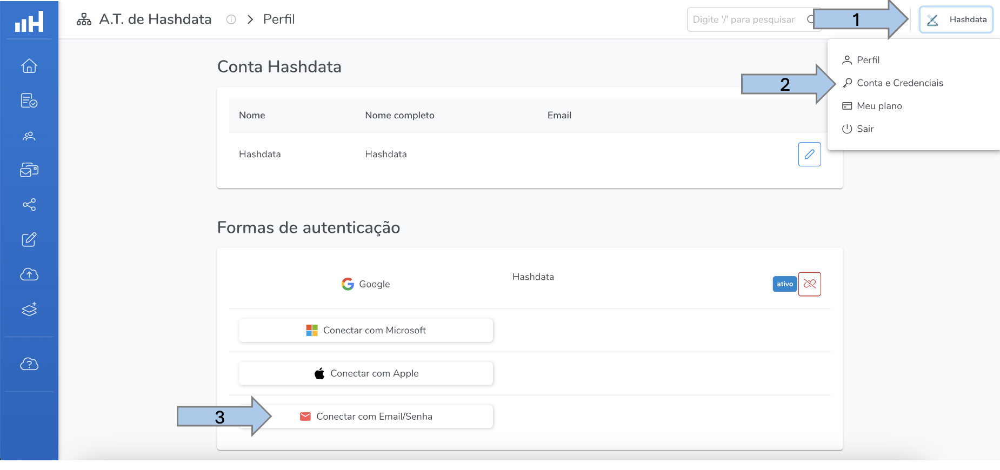

import Mermaid from '@theme/Mermaid';
export const standardCaption = '. Clique na imagem para ampliá-la.'
export const initialScreamCaption = 'Apresentação da Tela Inicial do Hashdata' + standardCaption;

# Instruções de migração para usuários

## Questões repetidas *versus* questões multiconteúdo {#repeated-questions-versus-multi-content-questions}

### Versão Antiga da Hashdata {#ancient-version}

Na versão antiga do Hashdata, para se configurar questões multiconteúdo, havia duas opções:

1. Utilizar **lógica de navegação**, ou;
2. Utilizar **lógica de exibição**.

Para exemplificar as questões multiconteúdo, vamos considerar um formulário de cadastro que solicita a informação do
`Estado`, da `Cidade` e do `Endereço` das pessoas. Não seria uma boa prática exibir, na questão `Cidade`, os mais 5.000
municípios brasileiros como opções de seleção. Uma melhor solução seria exibir, na questão `Cidade`, apenas os municípios
da Unidade da Federação escolhida pelo usuário.

Para isso, seriam necessários 28 elementos de **Múltiplas opções (apenas uma resposta)**: um para se escolher o Estado
e outros 27 para agrupar as cidades de cada Unidade da Federação.

Veja a seguir como ficariam as questões multiconteúdo configuradas em cada uma das abordagens acima na versão antiga
do sistema:

#### 1. Lógica de navegação {#navigation-logic-approach}

Utilizando-se do recurso de lógica de navegação, seria necessária a seguinte configuração:

:::warning Lembrando...
Quando a lógica de navegação está habilitada, o sistema exibe as questões até encontrar uma lógica de navegação configurada.
Neste ponto, o fluxo é interrompido e o sistema aguarda o usuário clicar em **Avançar**.
:::

<ol>
    1. Na questão Estado, para cada uma das 27 respostas possíveis, seria necessário cadastrar uma condição, por
    exemplo:

    ```text
    Se a resposta for igual Acre vá para Cidades do Acre.
    Se a resposta for igual Alagoas vá para Cidades de Alagoas.
    Se a resposta for igual Amazonas vá para Cidades do Amazonas.
    (...)
    Se a resposta for igual Tocantins vá para Cidades de Tocantins.
    ```

    2. Para que, após a escolha da cidade, o fluxo do formulário siga para uma questão que não seja relacionada à
    escolha
    de cidade, todas as respostas possíveis de cada uma das questões que agrupam as cidades de cada estado, ou seja,
    `Cidades do Acre`, `Cidades de Alagoas` e assim por diante, teriam que possuir uma condição de **lógica de
    navegação**
    indicando para qual questão deve seguir, como a questão `Endereço`, por exemplo:

    - **Cidades do Acre**
    ```text
    Se a resposta for igual Acrelândia vá para Endereço.
    Se a resposta for igual Assis Brasil vá para Endereço.
    (...)
    ```
    - **(...)**

    - **Cidades de Tocantins**
    ```text
    Se a resposta for igual Abreulândia vá para Endereço.
    Se a resposta for igual Aguiarnópolis vá para Endereço.
    (...)
    ```
</ol>

Graficamente, a utilização de **lógica de navegação** para configurar questões multiconteúdo, considerando o exemplo acima,
ficaria assim:

````mdx-code-block
<div className="text-align-center">
    <Mermaid
        value={`
%%{init: {"flowchart": {"htmlLabels": true}} }%%
flowchart TB
 subgraph s1["Navegue para a Questão"]
        n3["Cidades do Acre"]
        n4["(...)"]
        n5["Cidades de Tocantins"]
  end
 subgraph s2["Navegue para a Questão"]
        n7["Endereço"]
  end

      n1[Estado] --> n2{Se a resposta for igual}

      n2 -- Acre --> n3
      n2 -- ... --> n4
      n2 -- Tocantins --> n5

      n3 --> n6{Se a resposta for igual}
      n6 -- Acrelânida --> s2
      n6 -- Assis Brasil --> s2
      n6 -- (...) --> s2

      n4 --> n8{Se a resposta for igual}
      n8 -- (...) --> s2

      n5 --> n9{Se a resposta for igual}
      n9 -- Abreulândia --> s2
      n9 -- Aguiarnópolis --> s2
      n9 -- (...) --> s2
    `}
    />
</div>
````

#### 2. Lógica de exibição {#exhibition-logic-approach}
Utilizando-se do recurso de lógica de exibição, seria necessária a seguinte configuração:

<ol>
    1. Em cada questão relacionada às cidades de cada Estado da Federação seria necessário habilitar a **lógica de
    exibição**
    e incluir uma condição de satisfação, sendo que:

    - **Cidades do Acre**
    ```text
    Referência: Estado
    Condição de satisfação: Se a resposta for igual Acre
    ```

    - **Cidades de Alagoas**
    ```text
    Referência: Estado
    Condição de satisfação: Se a resposta for igual Alagoas
    ```
    - **(...)**

    - **Cidades de Tocantins**
    ```text
    Referência: Estado
    Condição de satisfação: Se a resposta for igual Tocantins
    ```
</ol>

Graficamente, a utilização de **lógica de exibição** para configurar questões multiconteúdo, considerando o  exemplo proposto,
ficaria assim:

````mdx-code-block
<div className="text-align-center">
    <Mermaid
        value={`
%%{init: {"flowchart": {"htmlLabels": true}} }%%
flowchart LR
 subgraph s1["Exiba a Questão"]
        n4["Cidades do Acre"]
        n5["Cidades de Alagoas"]
        n6["(...)"]
        n7["Cidades de Tocantins"]
  end
    n1["Estado"] --> n2{"Se a resposta for igual a"}
    n2 -- Acre --> n4
    n2 -- Alagoas --> n5
    n2 -- (...) --> n6
    n2 -- Tocantins --> n7
    s1 --> n8["Endereço"]
    `}
    />
</div>
````

### Nova Versão da Hashdata {#new-version}

Na nova versão do Hashdata, a configuração de questões multiconteúdo ficou muito mais simples.

Utilizando o mesmo exemplo anterior, para exibir na questão `Cidade` apenas as cidades da Unidade da Federação escolhida, basta
utilizar apenas dois elementos do tipo **Seleção única**, um para o `Estado` e outro para a `Cidade`, em conjunto com a
funcionalidade [**conteúdo condicional (multiconteúdo)**](/forms/elements/condicional-content)


Graficamente, a configuração de questões multiconteúdo na nova versão, considerando o nosso exemplo, fica assim:

````mdx-code-block
<div className="text-align-center">
    <Mermaid
        value={`
%%{init: {"flowchart": {"htmlLabels": true}} }%%
flowchart LR
 subgraph s1["Questão com 27 conteúdos condicionais"]
        n2["Cidade"]
  end
    n1["Estado"] --> s1
    s1 --> n3["Endereço"]
    `}
    />
</div>
````


[Saiba mais](/forms/elements/condicional-content#practical_example) acompanhando a criação desse exemplo na prática.


## Migração de Conta

A migração de conta é o procedimento específico para as contas que já utilizavam a versão anterior do Hashdata. Este procedimento é realizado automaticamente pela equipe do Hashdata, no entanto, **caso seja necessário receber e-mails de notificações**, é preciso vincular a nova conta migrada a um e-mail e confirmar conforme as três etapas da imagem abaixo:

 <p className="image-caption">{initialScreamCaption}</p>

Após informar seu e-mail e escolher uma senha, você receberá um e-mail de confirmação.
Clique no link de confirmação e pronto! Seu e-mail foi confirmado com sucesso.
